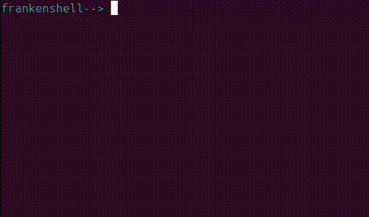

<!-- Improved compatibility of back to top link: See: https://github.com/othneildrew/Best-README-Template/pull/73 -->
<a name="readme-top"></a>
<!--
*** Thanks for checking out the Best-README-Template. If you have a suggestion
*** that would make this better, please fork the repo and create a pull request
*** or simply open an issue with the tag "enhancement".
*** Don't forget to give the project a star!
*** Thanks again! Now go create something AMAZING! :D
-->


<!-- PROJECT SHIELDS -->
<!--
*** I'm using markdown "reference style" links for readability.
*** Reference links are enclosed in brackets [ ] instead of parentheses ( ).
*** See the bottom of this document for the declaration of the reference variables
*** for contributors-url, forks-url, etc. This is an optional, concise syntax you may use.
*** https://www.markdownguide.org/basic-syntax/#reference-style-links
-->
[![Contributors][contributors-shield]][contributors-url]
[![Forks][forks-shield]][forks-url]
[![Stargazers][stars-shield]][stars-url]
[![Issues][issues-shield]][issues-url]
[![MIT License][license-shield]][license-url]
[![LinkedIn][linkedin-shield]][linkedin-url]

<!-- PROJECT LOGO -->
<br />
<div align="center">
  <a href="https://github.com/0815-alex/42_minishell">
    
  </a>

<h3 align="center">frankenshell</h3>

  <p align="center">
    frankenshell is a version of the 42 School project minishell that recreates a simplified version of the bash shell written in C
    <br />
    <a href="./docs/documentation.md"><strong>Explore the docs »</strong></a>
    <br />
    <br />
  </p>
</div>


<!-- TABLE OF CONTENTS -->
  <summary>Table of Contents</summary>
  <ol>
    <li><a href="#about-the-project">About The Project</a></li>
    <li><a href="#installation">Installation</a></li>
    <li><a href="#usage">Usage</a></li>
    <li><a href="#acknowledgments">Acknowledgments</a></li>
  </ol>

<!-- ABOUT THE PROJECT -->
# About The Project

As ChatGPT said in 2023:

> Minishell is a [42 school](https://42.fr/en/homepage/) project designed to create a simplified Unix shell. The idea behind Minishell is to develop a basic command-line interface (CLI) that can execute simple commands and handle input/output redirection. It's meant to serve as a learning exercise for students to gain a fundamental understanding of how shells work by implementing core features like parsing user input, managing processes, handling signals, creating builtins and executing system commands.

<p align="right">(<a href="#readme-top">back to top</a>)</p>

<!-- INSTALLATION -->
## Installation
```
# Clone this repository
$ git clone https://github.com/AshParker19/42_minishell

# Go into the repository
$ cd 42_minishell

# Compile the program
$ make

# Run the program
$ ./frankenshell [OPTIONS]

# OPTIONS:
# 	--info, -i	prints details about the program flow during runtime

# Use the program
frankenshell--> echo "Let's goooooo!"

# Exit the program
$ exit
```

<p align="right">(<a href="#readme-top">back to top</a>)</p>

<!-- USAGE EXAMPLES -->
## Usage

**frankenshell** is designed to mimic the behavior of the traditional **bash** shell. So feel free to use it like bash.

:warning: &nbsp; For more examples, please refer to the [Documentation](./docs/documentation.md)

(./docs/documentation.md)
<p align="right">(<a href="#readme-top">back to top</a>)</p>


<!-- ACKNOWLEDGMENTS -->
## Acknowledgments
Thx to all those guys and gals for hints, tipps and feedback!

[@Gabriel](https://github.com/portugueseTorch)\
[@Martim](https://github.com/mm1212)\
[@Margarida](https://github.com/MariaAguiar)\
[@Manuel](https://github.com/manuel-aguiar)

<p align="right">(<a href="#readme-top">back to top</a>)</p>


<!-- MARKDOWN LINKS & IMAGES -->
<!-- https://www.markdownguide.org/basic-syntax/#reference-style-links -->
[contributors-shield]: https://img.shields.io/github/contributors/0815-alex/42_minishell.svg?style=for-the-badge
[contributors-url]: https://github.com/0815-alex/42_minishell/graphs/contributors
[forks-shield]: https://img.shields.io/github/forks/0815-alex/42_minishell.svg?style=for-the-badge
[forks-url]: https://github.com/0815-alex/42_minishell/network/members
[stars-shield]: https://img.shields.io/github/stars/0815-alex/42_minishell.svg?style=for-the-badge
[stars-url]: https://github.com/0815-alex/42_minishell/stargazers
[issues-shield]: https://img.shields.io/github/issues/0815-alex/42_minishell.svg?style=for-the-badge
[issues-url]: https://github.com/0815-alex/42_minishell/issues
[license-shield]: https://img.shields.io/github/license/0815-alex/42_minishell.svg?style=for-the-badge
[license-url]: https://github.com/0815-alex/42_minishell/blob/master/LICENSE.txt
[linkedin-shield]: https://img.shields.io/badge/-LinkedIn-black.svg?style=for-the-badge&logo=linkedin&colorB=555
[linkedin-url]: https://linkedin.com/in/alex-ander-stein
[Next.js]: https://img.shields.io/badge/next.js-000000?style=for-the-badge&logo=nextdotjs&logoColor=white
[Next-url]: https://nextjs.org/
[React.js]: https://img.shields.io/badge/React-20232A?style=for-the-badge&logo=react&logoColor=61DAFB
[React-url]: https://reactjs.org/
[Vue.js]: https://img.shields.io/badge/Vue.js-35495E?style=for-the-badge&logo=vuedotjs&logoColor=4FC08D
[Vue-url]: https://vuejs.org/
[Angular.io]: https://img.shields.io/badge/Angular-DD0031?style=for-the-badge&logo=angular&logoColor=white
[Angular-url]: https://angular.io/
[Svelte.dev]: https://img.shields.io/badge/Svelte-4A4A55?style=for-the-badge&logo=svelte&logoColor=FF3E00
[Svelte-url]: https://svelte.dev/
[Laravel.com]: https://img.shields.io/badge/Laravel-FF2D20?style=for-the-badge&logo=laravel&logoColor=white
[Laravel-url]: https://laravel.com
[Bootstrap.com]: https://img.shields.io/badge/Bootstrap-563D7C?style=for-the-badge&logo=bootstrap&logoColor=white
[Bootstrap-url]: https://getbootstrap.com
[JQuery.com]: https://img.shields.io/badge/jQuery-0769AD?style=for-the-badge&logo=jquery&logoColor=white
[JQuery-url]: https://jquery.com 