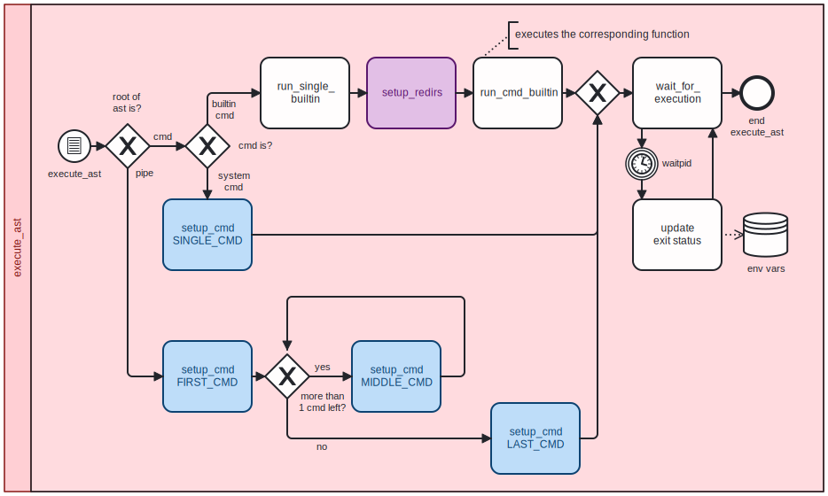

<a id="docu-top"></a>
<br />
<div align="center">
	<a href="../art.sh">
    	
  	</a>
  	<h1 align="center">Documentation of frankenshell</h1>
Version: 2.1<br>
Date: 2024-01-10
</div>

---

<p align="center">
  <a href="https://www.buymeacoffee.com/ahokcool" target="_blank">
    <br>
  </a>
  If this documentation is helpful for you, feel free to buy me a coffee ;)
</p>

---

**Legend**

 :top:						Link to top of the page / table of content	<br>	
 :link:						Link to external website					<br>
 :arrow_backward:			Link to parent section						<br>
 :book:						Link to another section						<br>
 :computer:		 			Link to related.c file						<br>
 :page_facing_up: 			Link to related.h file						<br>
 :bulb:	 					Hint										<br>
 :pencil2:					Example										<br>
 :warning:					Warning / Important							<br>
 :white_check_mark:			Yes / Success								<br>
 :x:						No / Fail									<br>
 
---


<br><h1 id="table-of-content">
	<a href="#docu-top">🔝 </a>
	Table of Contents
</h1>

1. [Introduction](#introduction)
1. [Installation](#installation)
1. [Usage](#usage)
	[[Info Mode](#info-mode)]
1. [Definitions](#definitions)
1. [Syntax](#syntax)
	[[Quotes](#quotes), 
	[Seperators](#seperators)]
1. [Structs](#structs)
	[[t_mbox](#t_mbox)]
1. [Environment Variables](#environment-variables)
1. [Builtins](#builtin-commands)
	[[42](#42-builtin), 
	[cd](#cd-builtin), 
	[echo](#echo-builtin), 
	[env](#env-builtin), 
	[exit](#exit-builtin), 
	[export](#export-builtin), 
	[help](#help-builtin), 
	[history](#history-builtin), 
	[infomode](#infomode-builtin), 
	[pwd](#pwd-builtin), 
	[unset](#unset-builtin)]
1. [Exit Status](#exit-status)
1. [Signals](#signals)
1. [How Frankenshell Operates](#how-frankenshell-operates)
	1. [Initialization](#initialization)
	1. [Processing a cycle](#processing-a-cycle)
		1. [String Management](#string-management)
			1. [Trim Input](#trim-input)
			1. [Mark Empty Quotes](#mark-empty-quotes)
				[[Quote State](#quote-state)]
			1. [Shift Separators](#shift-separators)
			1. [Variable Expansion](#variable-expansion)
		1. [Tokenizing](#tokenizing)
		1. [Parsing](#parsing)
       	1. [Executing](#executing)
			1. [Setup Command](#setup-command)
			1. [Setup Redirections](#setup-redirections)
			1. [Setup Heredoc](#setup-heredoc)
			1. [Run Command](#run-command)
		1. [Cleanup Cycle](#cleanup-cycle)
	1. [Termination](#termination)
1. [Known Bugs](#known-bugs)
1. [Acknowledgments](#acknowledgments)

<br><h1 id="introduction">
	<a href="#table-of-content">🔝 </a>
	Introduction
</h1>

As ChatGPT said in 2023:

> Minishell is a [:link: 42 school][url-42] project that aims to create a simplified Unix shell using [:link: bash][url-bash] as a reference. The idea behind Minishell is to develop a basic command-line interface (CLI) that can execute simple commands and handle input/output redirection. It's meant to serve as a learning exercise for students to gain a fundamental understanding of how shells work by implementing core features like parsing user input, managing processes, handling signals, creating builtins and executing system commands.

<br><h1 id="installation">
	<a href="#table-of-content">🔝 </a>
	Installation
</h1>

```
	$ git clone https://github.com/ahokcool/frankenshell.git	# Clone
	$ cd frankenshell											# Change directory
	$ make														# Compile
	$ ./frankenshell [OPTIONS]									# Run (Option: --info)
	$ echo "Let's goooooo!"										# Use
		Let's goooooo!
	$ exit														# Exit
```

:bulb: `make stats` provides you with some information about the files and the number of functions.

<br><h1 id="usage">
	<a href="#table-of-content">🔝 </a>
	Usage
</h1>

**frankenshell** is designed to mimic the behavior of the traditional [:link: **bash shell**][url-bash]. So feel free to use it like bash.

![Example][example-gif]

<br><h2 id="info-mode">
	<a href="#table-of-content">🔝 </a>
	<a href="#usage">◀️ </a>
	Info Mode
	<a href="../src/1_core/8_info_mode.c"> 💻</a>
</h2>

To activate the info mode you can
- [:book: start](#initialization) frankenshell with the flag `--info` or `-i`
- run the [builtin](#builtin-commands) command [infomode](#infomode-builtin)

If the info mode is activated frankenshell will print the following information during runtime.:

- Input String States ([:book: String Management](#string-management))<sup>*</sup>
- Token types and values ([:book: tokenizing](#tokenizing))
- A visual representation of the ast ([:book: parsing](#parsing))

<sup>*</sup> Also as [:book: readable strings](#readable-input-strings)

<details>
  <summary>✏️ Example <code>echo "Hello" $USER "" '!' | wc    -l&nbsp;&nbsp;&nbsp;&nbsp;&nbsp;</code></summary>

<pre>$ ./frankenshell -i
<font color="#A347BA"> -------------------------------------------------------------------------------- </font>
<font color="#A347BA">|                              INFO MODE ACTIVATED!                              |</font>
<font color="#A347BA"> -------------------------------------------------------------------------------- </font>
<font color="#2AA1B3">frankenshell--&gt; </font>echo &quot;Hello&quot; $USER &quot;&quot; &apos;!&apos; | wc    -l     
<font color="#FF5F5F"> -------------------------------------------------------------------------------- </font>
<font color="#FF5F5F">|                                  INPUT STATES                                  |</font>
<font color="#FF5F5F"> -------------------------------------------------------------------------------- </font>
<font color="#FF5F5F">original:</font>			<font color="#FF5F5F">(echo &quot;Hello&quot; $USER &quot;&quot; &apos;!&apos; | wc    -l     )</font>

<font color="#FF5F5F">trimmed:</font>			<font color="#FF5F5F">(echo &quot;Hello&quot; $USER &quot;&quot; &apos;!&apos; | wc    -l)</font>

<font color="#FF5F5F">empty quotes:</font>	<font color="#FF5F5F">shifted:</font>	<font color="#FF5F5F">(echo &quot;Hello&quot; $USER �� &apos;!&apos; | wc    -l)</font>
		<font color="#FF5F5F">readable:</font>	<font color="#FF5F5F">(echo &quot;Hello&quot; $USER E_ &apos;!&apos; | wc    -l)</font>

<font color="#FF5F5F">shifted:</font>	<font color="#FF5F5F">shifted:</font>	<font color="#FF5F5F">(echo��Hello��$USER�����!����wc����-l)</font>
		<font color="#FF5F5F">readable:</font>	<font color="#FF5F5F">(echo_DHelloD_$USER_E__S!S_P_wc____-l)</font>

<font color="#FF5F5F">expanded:</font>	<font color="#FF5F5F">shifted:</font>	<font color="#FF5F5F">(echo��Hello��astein�����!����wc����-l)</font>
		<font color="#FF5F5F">readable:</font>	<font color="#FF5F5F">(echo_DHelloD_astein_E__S!S_P_wc____-l)</font>
<font color="#FF5F5F">==================================================================================</font>

<font color="#A2734C"> -------------------------------------------------------------------------------- </font>
<font color="#A2734C">|                                   TOKENIZER                                    |</font>
<font color="#A2734C"> -------------------------------------------------------------------------------- </font>
<font color="#A2734C">type:(0) </font>	<font color="#A2734C"> token:(echo)</font>
<font color="#A2734C">type:(0) </font>	<font color="#A2734C"> token:(Hello)</font>
<font color="#A2734C">type:(0) </font>	<font color="#A2734C"> token:(astein)</font>
<font color="#A2734C">type:(0) </font>	<font color="#A2734C"> token:()</font>
<font color="#A2734C">type:(0) </font>	<font color="#A2734C"> token:(!)</font>
<font color="#A2734C">type:(1) </font>	<font color="#A2734C"> token:(|)</font>
<font color="#A2734C">type:(0) </font>	<font color="#A2734C"> token:(wc)</font>
<font color="#A2734C">type:(0) </font>	<font color="#A2734C"> token:(-l)</font>
<font color="#A2734C">==================================================================================</font>

<font color="#2AA1B3"> -------------------------------------------------------------------------------- </font>
<font color="#2AA1B3">|                                     PARSER                                     |</font>
<font color="#2AA1B3"> -------------------------------------------------------------------------------- </font>

<font color="#2AA1B3">              [arg] (-l)</font>

<font color="#2AA1B3">       [cmd] (wc)</font>

<font color="#2AA1B3">[|] (|)</font>

<font color="#2AA1B3">                                   [arg] (!)</font>

<font color="#2AA1B3">                            [arg] ()</font>

<font color="#2AA1B3">                     [arg] (astein)</font>

<font color="#2AA1B3">              [arg] (Hello)</font>

<font color="#2AA1B3">       [cmd] (echo)</font>
<font color="#2AA1B3">==================================================================================</font>

<font color="#26A269"> -------------------------------------------------------------------------------- </font>
<font color="#26A269">|                                    EXECUTOR                                    |</font>
<font color="#26A269">|                                 (cmd count: 2)                                 |</font>
<font color="#26A269"> -------------------------------------------------------------------------------- </font>
1
<font color="#26A269"> -------------------------------------------------------------------------------- </font>
<font color="#26A269">|                                    EXECUTOR                                    |</font>
<font color="#26A269">|                              LAST EXIT STATUS: 0                               |</font>
<font color="#26A269"> -------------------------------------------------------------------------------- </font>
<font color="#26A269">==================================================================================</font>

<font color="#2AA1B3">frankenshell--&gt; </font>

</pre>

</details>

<details>
  <summary>✏️ Example <code>ls -l -a</code></summary>

<pre>$ ./frankenshell -i
<font color="#A347BA"> -------------------------------------------------------------------------------- </font>
<font color="#A347BA">|                              INFO MODE ACTIVATED!                              |</font>
<font color="#A347BA"> -------------------------------------------------------------------------------- </font>
<font color="#2AA1B3">frankenshell--&gt; </font>ls -l -a
<font color="#FF5F5F"> -------------------------------------------------------------------------------- </font>
<font color="#FF5F5F">|                                  INPUT STATES                                  |</font>
<font color="#FF5F5F"> -------------------------------------------------------------------------------- </font>
<font color="#FF5F5F">original:</font>			<font color="#FF5F5F">(ls -l -a)</font>

<font color="#FF5F5F">trimmed:</font>			<font color="#FF5F5F">(ls -l -a)</font>

<font color="#FF5F5F">empty quotes:</font>	<font color="#FF5F5F">shifted:</font>	<font color="#FF5F5F">(ls -l -a)</font>
		<font color="#FF5F5F">readable:</font>	<font color="#FF5F5F">(ls -l -a)</font>

<font color="#FF5F5F">shifted:</font>	<font color="#FF5F5F">shifted:</font>	<font color="#FF5F5F">(ls�-l�-a)</font>
		<font color="#FF5F5F">readable:</font>	<font color="#FF5F5F">(ls_-l_-a)</font>

<font color="#FF5F5F">expanded:</font>	<font color="#FF5F5F">shifted:</font>	<font color="#FF5F5F">(ls�-l�-a)</font>
		<font color="#FF5F5F">readable:</font>	<font color="#FF5F5F">(ls_-l_-a)</font>
<font color="#FF5F5F">==================================================================================</font>

<font color="#A2734C"> -------------------------------------------------------------------------------- </font>
<font color="#A2734C">|                                   TOKENIZER                                    |</font>
<font color="#A2734C"> -------------------------------------------------------------------------------- </font>
<font color="#A2734C">type:(0) </font>	<font color="#A2734C"> token:(ls)</font>
<font color="#A2734C">type:(0) </font>	<font color="#A2734C"> token:(-l)</font>
<font color="#A2734C">type:(0) </font>	<font color="#A2734C"> token:(-a)</font>
<font color="#A2734C">==================================================================================</font>

<font color="#2AA1B3"> -------------------------------------------------------------------------------- </font>
<font color="#2AA1B3">|                                     PARSER                                     |</font>
<font color="#2AA1B3"> -------------------------------------------------------------------------------- </font>

<font color="#2AA1B3">              [arg] (-a)</font>

<font color="#2AA1B3">       [arg] (-l)</font>

<font color="#2AA1B3">[cmd] (ls)</font>
<font color="#2AA1B3">==================================================================================</font>

<font color="#26A269"> -------------------------------------------------------------------------------- </font>
<font color="#26A269">|                                    EXECUTOR                                    |</font>
<font color="#26A269">|                                 (cmd count: 1)                                 |</font>
<font color="#26A269"> -------------------------------------------------------------------------------- </font>
total 276
drwxrwxr-x 10 astein astein   4096 Jan 10 11:10 .
drwxrwxr-x  3 astein astein   4096 Dez 15 14:03 ..
-rwxrwxr-x  1 astein astein   6323 Dez 15 20:15 art.sh
-rwxrwxr-x  1 astein astein   1498 Dez 15 20:03 count_stats.sh
drwxrwxr-x  2 astein astein   4096 Jan  9 14:42 docs
-rw-rw-r--  1 astein astein      1 Jan 10 11:35 file
-rwxrwxr-x  1 astein astein 208296 Jan 10 09:01 frankenshell
drwxrwxr-x  8 astein astein   4096 Jan  9 20:50 .git
-rw-rw-r--  1 astein astein    215 Dez 15 20:03 .gitignore
drwxrwxr-x  3 astein astein   4096 Jan 10 11:55 images
drwxrwxr-x  2 astein astein   4096 Jan  7 11:45 includes
drwxrwxr-x  4 astein astein   4096 Jan 10 09:01 libft
-rw-rw-r--  1 astein astein   3429 Jan  7 14:20 Makefile
drwxrwxr-x  6 astein astein   4096 Jan 10 09:01 obj
-rw-rw-r--  1 astein astein   1638 Jan  6 17:33 README1.md
-rw-rw-r--  1 astein astein   2587 Jan  9 16:30 README.md
drwxrwxr-x  6 astein astein   4096 Jan  7 14:17 src
drwxrwxr-x  2 astein astein   4096 Dez 15 20:22 .vscode
<font color="#26A269"> -------------------------------------------------------------------------------- </font>
<font color="#26A269">|                                    EXECUTOR                                    |</font>
<font color="#26A269">|                              LAST EXIT STATUS: 0                               |</font>
<font color="#26A269"> -------------------------------------------------------------------------------- </font>
<font color="#26A269">==================================================================================</font>

<font color="#2AA1B3">frankenshell--&gt; </font>
</pre>

</details>

<details>
  <summary>✏️ Example <code>echo the home dir of $USER is storred in '$HOME'</code></summary>

<pre>$ ./frankenshell -i
<font color="#A347BA"> -------------------------------------------------------------------------------- </font>
<font color="#A347BA">|                              INFO MODE ACTIVATED!                              |</font>
<font color="#A347BA"> -------------------------------------------------------------------------------- </font>
<font color="#2AA1B3">frankenshell--&gt; </font>echo the home dir of $USER is storred in &apos;$HOME&apos;
<font color="#FF5F5F"> -------------------------------------------------------------------------------- </font>
<font color="#FF5F5F">|                                  INPUT STATES                                  |</font>
<font color="#FF5F5F"> -------------------------------------------------------------------------------- </font>
<font color="#FF5F5F">original:</font>			<font color="#FF5F5F">(echo the home dir of $USER is storred in &apos;$HOME&apos;)</font>

<font color="#FF5F5F">trimmed:</font>			<font color="#FF5F5F">(echo the home dir of $USER is storred in &apos;$HOME&apos;)</font>

<font color="#FF5F5F">empty quotes:</font>	<font color="#FF5F5F">shifted:</font>	<font color="#FF5F5F">(echo the home dir of $USER is storred in &apos;$HOME&apos;)</font>
		<font color="#FF5F5F">readable:</font>	<font color="#FF5F5F">(echo the home dir of $USER is storred in &apos;$HOME&apos;)</font>

<font color="#FF5F5F">shifted:</font>	<font color="#FF5F5F">shifted:</font>	<font color="#FF5F5F">(echo�the�home�dir�of�$USER�is�storred�in��$HOME�)</font>
		<font color="#FF5F5F">readable:</font>	<font color="#FF5F5F">(echo_the_home_dir_of_$USER_is_storred_in_S$HOMES)</font>

<font color="#FF5F5F">expanded:</font>	<font color="#FF5F5F">shifted:</font>	<font color="#FF5F5F">(echo�the�home�dir�of�astein�is�storred�in��$HOME�)</font>
		<font color="#FF5F5F">readable:</font>	<font color="#FF5F5F">(echo_the_home_dir_of_astein_is_storred_in_S$HOMES)</font>
<font color="#FF5F5F">==================================================================================</font>

<font color="#A2734C"> -------------------------------------------------------------------------------- </font>
<font color="#A2734C">|                                   TOKENIZER                                    |</font>
<font color="#A2734C"> -------------------------------------------------------------------------------- </font>
<font color="#A2734C">type:(0) </font>	<font color="#A2734C"> token:(echo)</font>
<font color="#A2734C">type:(0) </font>	<font color="#A2734C"> token:(the)</font>
<font color="#A2734C">type:(0) </font>	<font color="#A2734C"> token:(home)</font>
<font color="#A2734C">type:(0) </font>	<font color="#A2734C"> token:(dir)</font>
<font color="#A2734C">type:(0) </font>	<font color="#A2734C"> token:(of)</font>
<font color="#A2734C">type:(0) </font>	<font color="#A2734C"> token:(astein)</font>
<font color="#A2734C">type:(0) </font>	<font color="#A2734C"> token:(is)</font>
<font color="#A2734C">type:(0) </font>	<font color="#A2734C"> token:(storred)</font>
<font color="#A2734C">type:(0) </font>	<font color="#A2734C"> token:(in)</font>
<font color="#A2734C">type:(0) </font>	<font color="#A2734C"> token:($HOME)</font>
<font color="#A2734C">==================================================================================</font>

<font color="#2AA1B3"> -------------------------------------------------------------------------------- </font>
<font color="#2AA1B3">|                                     PARSER                                     |</font>
<font color="#2AA1B3"> -------------------------------------------------------------------------------- </font>

<font color="#2AA1B3">                                                               [arg] ($HOME)</font>

<font color="#2AA1B3">                                                        [arg] (in)</font>

<font color="#2AA1B3">                                                 [arg] (storred)</font>

<font color="#2AA1B3">                                          [arg] (is)</font>

<font color="#2AA1B3">                                   [arg] (astein)</font>

<font color="#2AA1B3">                            [arg] (of)</font>

<font color="#2AA1B3">                     [arg] (dir)</font>

<font color="#2AA1B3">              [arg] (home)</font>

<font color="#2AA1B3">       [arg] (the)</font>

<font color="#2AA1B3">[cmd] (echo)</font>
<font color="#2AA1B3">==================================================================================</font>

<font color="#26A269"> -------------------------------------------------------------------------------- </font>
<font color="#26A269">|                                    EXECUTOR                                    |</font>
<font color="#26A269">|                                 (cmd count: 1)                                 |</font>
<font color="#26A269"> -------------------------------------------------------------------------------- </font>
the home dir of astein is storred in $HOME
<font color="#26A269"> -------------------------------------------------------------------------------- </font>
<font color="#26A269">|                                    EXECUTOR                                    |</font>
<font color="#26A269">|                              LAST EXIT STATUS: 0                               |</font>
<font color="#26A269"> -------------------------------------------------------------------------------- </font>
<font color="#26A269">==================================================================================</font>

<font color="#2AA1B3">frankenshell--&gt; </font>
</pre>

</details>

<details>
  <summary>✏️ Example <code><< $DONT_EXPAND cat | wc -l</code></summary>

<pre>$ ./frankenshell -i
<font color="#A347BA"> -------------------------------------------------------------------------------- </font>
<font color="#A347BA">|                              INFO MODE ACTIVATED!                              |</font>
<font color="#A347BA"> -------------------------------------------------------------------------------- </font>
<font color="#2AA1B3">frankenshell--&gt; </font>&lt;&lt; $DONT_EXPAND cat | wc -l
<font color="#FF5F5F"> -------------------------------------------------------------------------------- </font>
<font color="#FF5F5F">|                                  INPUT STATES                                  |</font>
<font color="#FF5F5F"> -------------------------------------------------------------------------------- </font>
<font color="#FF5F5F">original:</font>			<font color="#FF5F5F">(&lt;&lt; $DONT_EXPAND cat | wc -l)</font>

<font color="#FF5F5F">trimmed:</font>			<font color="#FF5F5F">(&lt;&lt; $DONT_EXPAND cat | wc -l)</font>

<font color="#FF5F5F">empty quotes:</font>	<font color="#FF5F5F">shifted:</font>	<font color="#FF5F5F">(&lt;&lt; $DONT_EXPAND cat | wc -l)</font>
		<font color="#FF5F5F">readable:</font>	<font color="#FF5F5F">(&lt;&lt; $DONT_EXPAND cat | wc -l)</font>

<font color="#FF5F5F">shifted:</font>	<font color="#FF5F5F">shifted:</font>	<font color="#FF5F5F">(���$DONT_EXPAND�cat���wc�-l)</font>
		<font color="#FF5F5F">readable:</font>	<font color="#FF5F5F">(II_$DONT_EXPAND_cat_P_wc_-l)</font>

<font color="#FF5F5F">expanded:</font>	<font color="#FF5F5F">shifted:</font>	<font color="#FF5F5F">(��$DONT_EXPAND�cat���wc�-l)</font>
		<font color="#FF5F5F">readable:</font>	<font color="#FF5F5F">(II$DONT_EXPAND_cat_P_wc_-l)</font>
<font color="#FF5F5F">==================================================================================</font>

<font color="#A2734C"> -------------------------------------------------------------------------------- </font>
<font color="#A2734C">|                                   TOKENIZER                                    |</font>
<font color="#A2734C"> -------------------------------------------------------------------------------- </font>
<font color="#A2734C">type:(2) </font>	<font color="#A2734C"> token:(&lt;)</font>
<font color="#A2734C">type:(2) </font>	<font color="#A2734C"> token:(&lt;)</font>
<font color="#A2734C">type:(0) </font>	<font color="#A2734C"> token:($DONT_EXPAND)</font>
<font color="#A2734C">type:(0) </font>	<font color="#A2734C"> token:(cat)</font>
<font color="#A2734C">type:(1) </font>	<font color="#A2734C"> token:(|)</font>
<font color="#A2734C">type:(0) </font>	<font color="#A2734C"> token:(wc)</font>
<font color="#A2734C">type:(0) </font>	<font color="#A2734C"> token:(-l)</font>
<font color="#A2734C">==================================================================================</font>

<font color="#2AA1B3"> -------------------------------------------------------------------------------- </font>
<font color="#2AA1B3">|                                     PARSER                                     |</font>
<font color="#2AA1B3"> -------------------------------------------------------------------------------- </font>

<font color="#2AA1B3">              [arg] (-l)</font>

<font color="#2AA1B3">       [cmd] (wc)</font>

<font color="#2AA1B3">[|] (|)</font>

<font color="#2AA1B3">       [cmd] (cat)</font>

<font color="#2AA1B3">              [&lt;&lt;] ($DONT_EXPAND)</font>
<font color="#2AA1B3">==================================================================================</font>

<font color="#26A269"> -------------------------------------------------------------------------------- </font>
<font color="#26A269">|                                    EXECUTOR                                    |</font>
<font color="#26A269">|                                 (cmd count: 2)                                 |</font>
<font color="#26A269"> -------------------------------------------------------------------------------- </font>
<font color="#A2734C">frankendoc&gt; </font>Hello
<font color="#A2734C">frankendoc&gt; </font>World
<font color="#A2734C">frankendoc&gt; </font>$DONT_EXPAND
2
<font color="#26A269"> -------------------------------------------------------------------------------- </font>
<font color="#26A269">|                                    EXECUTOR                                    |</font>
<font color="#26A269">|                              LAST EXIT STATUS: 0                               |</font>
<font color="#26A269"> -------------------------------------------------------------------------------- </font>
<font color="#26A269">==================================================================================</font>

<font color="#2AA1B3">frankenshell--&gt; </font>
</pre>

</details>

<details>
  <summary>✏️ Example <code>echo hi"" "" "" ""there</code></summary>

<pre>$ ./frankenshell -i
<font color="#A347BA"> -------------------------------------------------------------------------------- </font>
<font color="#A347BA">|                              INFO MODE ACTIVATED!                              |</font>
<font color="#A347BA"> -------------------------------------------------------------------------------- </font>
<font color="#2AA1B3">frankenshell--&gt; </font>echo hi&quot;&quot; &quot;&quot; &quot;&quot; &quot;&quot;there
<font color="#FF5F5F"> -------------------------------------------------------------------------------- </font>
<font color="#FF5F5F">|                                  INPUT STATES                                  |</font>
<font color="#FF5F5F"> -------------------------------------------------------------------------------- </font>
<font color="#FF5F5F">original:</font>			<font color="#FF5F5F">(echo hi&quot;&quot; &quot;&quot; &quot;&quot; &quot;&quot;there</font>
<font color="#FF5F5F">)</font>

<font color="#FF5F5F">trimmed:</font>			<font color="#FF5F5F">(echo hi&quot;&quot; &quot;&quot; &quot;&quot; &quot;&quot;there)</font>

<font color="#FF5F5F">empty quotes:</font>	<font color="#FF5F5F">shifted:</font>	<font color="#FF5F5F">(echo hi&quot;&quot; �� �� &quot;&quot;there)</font>
		<font color="#FF5F5F">readable:</font>	<font color="#FF5F5F">(echo hi&quot;&quot; E_ E_ &quot;&quot;there)</font>

<font color="#FF5F5F">shifted:</font>	<font color="#FF5F5F">shifted:</font>	<font color="#FF5F5F">(echo�hi�����������there)</font>
		<font color="#FF5F5F">readable:</font>	<font color="#FF5F5F">(echo_hiDD_E__E__DDthere)</font>

<font color="#FF5F5F">expanded:</font>	<font color="#FF5F5F">shifted:</font>	<font color="#FF5F5F">(echo�hi�����������there)</font>
		<font color="#FF5F5F">readable:</font>	<font color="#FF5F5F">(echo_hiDD_E__E__DDthere)</font>
<font color="#FF5F5F">==================================================================================</font>

<font color="#A2734C"> -------------------------------------------------------------------------------- </font>
<font color="#A2734C">|                                   TOKENIZER                                    |</font>
<font color="#A2734C"> -------------------------------------------------------------------------------- </font>
<font color="#A2734C">type:(0) </font>	<font color="#A2734C"> token:(echo)</font>
<font color="#A2734C">type:(0) </font>	<font color="#A2734C"> token:(hi)</font>
<font color="#A2734C">type:(0) </font>	<font color="#A2734C"> token:()</font>
<font color="#A2734C">type:(0) </font>	<font color="#A2734C"> token:()</font>
<font color="#A2734C">type:(0) </font>	<font color="#A2734C"> token:(there)</font>
<font color="#A2734C">==================================================================================</font>

<font color="#2AA1B3"> -------------------------------------------------------------------------------- </font>
<font color="#2AA1B3">|                                     PARSER                                     |</font>
<font color="#2AA1B3"> -------------------------------------------------------------------------------- </font>

<font color="#2AA1B3">                            [arg] (there)</font>

<font color="#2AA1B3">                     [arg] ()</font>

<font color="#2AA1B3">              [arg] ()</font>

<font color="#2AA1B3">       [arg] (hi)</font>

<font color="#2AA1B3">[cmd] (echo)</font>
<font color="#2AA1B3">==================================================================================</font>

<font color="#26A269"> -------------------------------------------------------------------------------- </font>
<font color="#26A269">|                                    EXECUTOR                                    |</font>
<font color="#26A269">|                                 (cmd count: 1)                                 |</font>
<font color="#26A269"> -------------------------------------------------------------------------------- </font>
hi   there
<font color="#26A269"> -------------------------------------------------------------------------------- </font>
<font color="#26A269">|                                    EXECUTOR                                    |</font>
<font color="#26A269">|                              LAST EXIT STATUS: 0                               |</font>
<font color="#26A269"> -------------------------------------------------------------------------------- </font>
<font color="#26A269">==================================================================================</font>

<font color="#2AA1B3">frankenshell--&gt; </font>
</pre>

</details>

---


<br><h1 id="definitions">
    <a href="#table-of-content">🔝 </a>
    Definitions
</h1>

These definitions are used throughout this manual as follows.

**builtin** ([:book: builtins](#builtin-commands))\
&nbsp;&nbsp;&nbsp;&nbsp;A command that is implemented internally by the shell itself, rather than by an executable program somewhere in the file system.

**exit status** ([:book: exit status](#exit-status))\
&nbsp;&nbsp;&nbsp;&nbsp;The value returned by a command to its caller. The value is restricted to eight bits, so the maximum value is 255.

**signal** ([:book: signals](#signals))\
&nbsp;&nbsp;&nbsp;&nbsp;A mechanism by which a process may be notified by the kernel of an event occurring in the system.

**token** ([:book: tokenizing](#tokenizing))\
&nbsp;&nbsp;&nbsp;&nbsp;A sequence of characters considered a single unit by frankenshell.

**cycle** ([:book: processing a cycle](#processing-a-cycle))\
&nbsp;&nbsp;&nbsp;&nbsp;The input is processed after the user hits the `return` key, which involves a series of steps: cleaning the input string, expanding variables, tokenizing, constructing an ast, setting up pipes, forking processes, and updating the exit status.

**ast / tree** ([:book: parsing](#parsing))\
&nbsp;&nbsp;&nbsp;&nbsp;The parser in Frankenshell constructs an abstract syntax tree (AST).

<br><h1 id="syntax">
    <a href="#table-of-content">🔝 </a>
    Syntax
</h1>

The syntax of frankenshell is designed to mimic the syntax of the traditional [:link: bash shell][url-bash].

Note that redirections and arguments can be in any order. The only rule is that right after the redirections there must be the filename (or limitter for heredoc).

**:pencil2: Examples**

```
# The following examples are all behaving the same way,
# which is to write "Hello World" into the file "file".

$ echo Hello World > file
$ echo Hello > file World
$ echo > fileHello World
```

<h2 id="quotes">
	<a href="#table-of-content">🔝 </a>
	<a href="#syntax">◀️ </a>
	Quotes
</h2>

- **Single Quotes**:\
Enclosing text in single quotes `'` prevents the shell from interpreting any metacharacters within the quoted sequence.
- **Double Quotes**:\
Using double quotes `"` also prevents interpretation of metacharacters, except for the dollar sign `$`, which is used for [:book: variable expansion](#variable-expansion).

If you use single quotes inside double quotes, the single quotes will be interpreted as a normal character and vice versa.

:bulb: The outer quotes are always the contextual quotes.\
:bulb: An contextual quote (single or double) must always be closed with an matching quote.\
:warning: If contextual quotes are not closed, frankenshell prints an error and updates the [:book: exit status](#exit-status) to `2`.


**:pencil2: Examples**
```
$ echo "this single quote: ' is inside contextual quotes and therefore not contextual!"
this single quote: ' is inside contextual quotes and therefore not contextual!

$ echo 'this double quote: " is inside contextual quotes and therefore not contextual!'
this double quote: " is inside contextual quotes and therefore not contextual!

$ echo "this is a pipe symbol | inside contextual quotes"
this is a pipe symbol | inside contextual quotes

$ echo "this single quote ' doesn't close the double quote
frankenshell: syntax error: unclosed quotes
```


<h2 id="seperators">
	<a href="#table-of-content">🔝 </a>
	<a href="#syntax">◀️ </a>
	Separators
</h2>

The following characters are used as seperators for the input string
| Symbol | Description              |
|--------|--------------------------|
| `'` `"`| contextual quotes        |
| `\|`   | pipe	                    |
| `<`    | redirection in           |
| `<<`   | frankendoc aka heredoc   |
| `>`    | redirection out          |
| `>>`   | redirection out append   |

:warning: frankenshell **doesn't** support those seperators:\
`;`, `&`, `&&`,`||`, `(`, `)`, `{`, `}`, `*`, `[`, `]`, `~`, `!`, `=`, `+`, `-`, `/`, `%`, `^`, `@`, `#`, `:`, `,`, `.`


<br><h1 id="structs">
    <a href="#table-of-content">🔝 </a>
    Structs
	<a href="../includes/structs.h">📄</a>
</h1>

All structs are defined int the header file [structs.h](../includes/structs.h).


<h2 id="t_mbox">
	<a href="#table-of-content">🔝 </a>
	<a href="#structs">◀️ </a>
	t_mbox
	<a href="../includes/structs.h">📄</a>
	<a href="../src/1_core/0_mbox.c">💻</a>
</h2>

The struct `mbox` is the main structure of the program: it is being passed as an argument to most of the functions and contains all the info needed for the program to work.\
The file ['manage_mbox.c'](../src/1_core/0_mbox.c) contains the functions for initializing and destroying the mbox instance.
```
typedef struct s_mbox
{
	char	*inp_orig;				// (  echo $USER "" > file)
	char	*inp_trim;				// (echo $USER "" > file)
	char	*inp_eq;				// (echo $USER E_ > file)
	char	*inp_shift;				// (echo $USER E_ O file)
	char	*inp_expand;			// (echo astein E_ O file)
	int		consecutive_lt;			// << lol << lol
	bool	syntax_err_encountered;	// track the first error
	t_env	*env;					// env vars as linked list
	t_list	*history_lst;			// history as linked list
	t_token	*tokens;				// tokens as linked list
	t_token	*tmp_token;				// temp token for building ast
	t_ast	*ast;					// root of the ast
	t_ast	*tmp_node;				// temp node for building ast
	t_exec	exec;					// execution data
	int		count_cycles;			// cycles for heredoc error msg
	t_bool	info_mode;				// info mode on/off
} t_mbox;
```

<br><h1 id="environment-variables">
    <a href="#table-of-content">🔝 </a>
    Environment Variables
	<a href="../src/1_core/4_env_vars.c">💻</a>
</h1>


This is general information about environment variables in frankenshell.

**Related Sections:**\
[:book: variable expansion](#variable-expansion) 
[:book: heredoc](#setup-heredoc)
[:book: env](#env-builtin)
[:book: export](#export-builtin)
[:book: unset](#unset-builtin)
[:book: exit status](#exit-status)

On [:book: programm start](#initialization) a linked list (t_env) will be created from the enviromental variables (`char **env`) and stored in the [t_mbox](#t_mbox) struct. Variables represent a simple key-value pair. Key and value are strings. The key is always unique and the value can be empty. On [:book: termination](#termination), the linked list is freed.

**With the following [:book: builtin](#builtin-commands) commands variables can be...**
- **created** using [:book: export](#export-builtin)
- **shown** using [:book: env](#env-builtin)
- **sorted and shown**  using [:book: export](#export-builtin) without arguments
- **changed** using [:book: export](#export-builtin)
- **deleted** using [:book: unset](#unset-builtin)

**A key has to match the following [regex][url-regex]:**
```
^[a-zA-Z_]+[a-zA-Z0-9_]*$

Explanation:
^				# start of string
[a-zA-Z_]		# first char must be a letter or '_'
+				# one or more chars
[a-zA-Z0-9_]*	# zero or more letters, numbers or '_'
$				# end of string
```

**The following functions are implemented in the [env_vars](../src/1_core/4_env_vars.c) file:**
```
MANAGEMENT
 	'initialize_vars'	# creates the ll on startup
	'free_vars'			# frees the ll
	'free_var'			# free the given node
	'var_add_back'		# adds the node to the end of the ll

READ FUNCTIONS
 	'is_var'			# checks if the argument 'key' is present in list
	'get_var_node'		# returns a pointer to the node with the given key
	'get_var_value'		# returns a pointer to the value of the given key
	'get_vars_count'	# returns the amount of nodes in the ll
	'get_env_as_matrix'	# creates a matrix of strings from the ll

WRITE FUNCTIONS
	'set_var_value'		# updates/creates node with the given key and value
	'set_var_value_int'	# updates/creates node with the given key and int value
	'increment_shlvl'	# increases the value of the 'SHLVL' variable
	'unset_var'			# removes the node with the given key from the ll
```


:bulb:    		The linked list will be used for the execve function call. Refer to section ([:book: run command](#run-command)).\
:bulb:			The linked list will be used for storing the [exit status](#exit-status).


<br><h1 id="builtin-commands">
    <a href="#table-of-content">🔝 </a>
    Builtins
</h1>


Each built-in command in frankenshell is detailed below with specific information and examples.

| Command                         | File(s)     	                                      												| Description									|
|---------------------------------|-----------------------------------------------------------------------------------------------------|-----------------------------------------------|
| [:book: `42`](#42-builtin)             | [:computer: `42.c`](../src/4_builtins/42.c)                    												| 42 it is ;)                                 	|
| [:book: `cd`](#cd-builtin)             | [:computer: `cd.c`](../src/4_builtins/cd.c)                    												| Changes the current directory.              	|
| [:book: `echo`](#echo-builtin)         | [:computer: `echo.c`](../src/4_builtins/echo.c)                												| Displays a line of text.                    	|
| [:book: `env`](#env-builtin)           | [:computer: `env.c`](../src/4_builtins/env.c)                  												| Displays the environment variables.         	|
| [:book: `exit`](#exit-builtin)         | [:computer: `exit.c`](../src/4_builtins/exit.c)                												| Exits the shell.                            	|
| [:book: `export`](#export-builtin)     | [:computer: `export.c`](../src/4_builtins/export.c)<br>[:computer: `export_utils.c`](../src/4_builtins/export_utils.c)	| Sets or exports environment variables.      	|
| [:book: `help`](#help-builtin)         | [:computer: `help.c`](../src/4_builtins/help.c)                												| Displays this documentation page on github  	|
| [:book: `history`](#history-builtin)   | [:computer: `history.c`](../src/4_builtins/history.c)          												| Displays the command history.               	|
| [:book: `infomode`](#infomode-builtin) | [:computer: `infomode.c`](../src/4_builtins/infomode.c)        												| Toggles the info mode.                      	|
| [:book: `pwd`](#pwd-builtin)           | [:computer: `pwd.c`](../src/4_builtins/pwd.c)                  												| Prints the working directory.               	|
| [:book: `unset`](#unset-builtin)       | [:computer: `unset.c`](../src/4_builtins/unset.c)              												| Unsets environment variables.               	|

---


<h2 id="42-builtin">
	<a href="#table-of-content">🔝 </a>
	<a href="#builtin-commands">◀️ </a>
	42 (builtin)
</h2>

The builtin `42` displays a 42 logo to `STDOUT` (or its redirection).

<details>
  <summary>Attributes</summary>

| Attribute				| Details									|
|-----------------------|-------------------------------------------|
| Flags                 | `N/A`	                 					|
| Number of Arguments   | `0 to n` (all args will be ignored)   	|
| Exit Status           | `0`				           				|
| Affected Variables    | `[NONE]`			           				|
| File				    | [`42.c`](../src/4_builtins/42.c)			|

</details>

<details>
  <summary>Examples</summary>

| **CMD**            	| **STDOUT**    				| **Explanation**       	|
|-----------------------|-------------------------------|---------------------------|
| `42`					| [the 42 logo] 				|							|
| `42 foo bar`			| [the 42 logo] 				| all args will be ignored	|

</details>

<details>
  <summary>Screenshot</summary>

  ![42][builtin_42]  
</details>

---


<h2 id="cd-builtin">
	<a href="#table-of-content">🔝 </a>
	<a href="#builtin-commands">◀️ </a>
	cd (builtin)
</h2>

The builtin `cd` runs a few checks to ensure the provided path is valid. Once it's all good, it uses the external function `chdir` to change the current working directory (wd) to this new path. At the same time, it updates the `PWD` variable to the new directory and `OLDPWD` to the previous one (if they exist).

:warning: 			If the external function `chdir` fails, an error message is printed and the exit status is set to `1`.\
:bulb: 	If `PWD` and/or `OLDPWD` are absent, the function operates normally and skips setting these variables.

<details>
  <summary>Attributes</summary>

| Attribute				| Details						|
|-----------------------|-------------------------------|
| Flags                 | `N/A`	                 		|
| Number of Arguments   | `0` - `1`				   		|
| Argument Format	   	| absolute or relative path	   	|
| Exit Status           | `0` `1`			           	|
| Affected Variables    | `HOME` `OLDPWD` `PWD`        	|
| File				    | [`cd.c`](../src/4_builtins/cd.c)|


</details>

<details>
  <summary>Examples</summary>

| **CMD**          	| **STDERR** 												|**Exit Status**| **Explanation**       			 		| **Affected Variables**<sup>1</sup>	|
|-------------------|-----------------------------------------------------------|:-------------:|-------------------------------------------|---------------------------------------|
| `cd`				| 															| `0`		 	| if `HOME` **is** set 						| `HOME` **`OLDPWD`** **`PWD`**			|
| `cd`				| `cd: HOME not set`										| `1`		 	| if `HOME` **is not** set					| 										|
| `cd ""`			| 															| `0`		 	| empty argument; <br> wd doesn't update	| 										|
| `cd valid_path`	| 															| `0` 		 	| wd updates to <br> `./valid_path`			| **`OLDPWD`** **`PWD`**				|
| `cd .`			| 															| `0` 		 	| wd doesn't update; <br> `OLDPWD` updated!	| **`OLDPWD`**							|
| `cd ..`			| 															| `0` 		 	| wd updates to <br> parent folder			| **`OLDPWD`** **`PWD`**				|
| `cd foo bar`		| `cd: too many arguments`									| `1`			|											|			 							|
| `cd noExist`		| `frankenshell: cd: noExist: No such file or directory`	| `1` 			|											|			 							|
| `cd noPermDir`	| `frankenshell: cd: noPermDir: Permission denied`			| `1` 			|											|			 							|
| `cd file`			| `frankenshell: cd: file: Not a directory`					| `1` 			|											|			 							|

<sup>1</sup> Bold variables will be updated.

</details>

---


<h2 id="echo-builtin">
	<a href="#table-of-content">🔝 </a>
	<a href="#builtin-commands">◀️ </a>
	echo (builtin)
</h2>

The builtin `echo` outputs the strings it is given as arguments, seperated by one space each, to `STDOUT` (or its redirection). The flag `-n` can be used to prevent the trailing newline that is normally printed.

<details>
  <summary>Attributes</summary>

| Attribute				| Details						|
|-----------------------|-------------------------------|
| Flags                 | `-n`		                 	|
| Number of Arguments   | `0` - `n`					  	|
| Argument Format	   	| all ASCII chars allowed		|
| Exit Status           | `0`				           	|
| Affected Variables    | `[NONE]`			       		|
| File				    | [`echo.c`](../src/4_builtins/echo.c)	|


</details>

<details>
  <summary>Examples</summary>

| **CMD**            	| **STDOUT**    | **LINEBREAK** 	|
|-----------------------|---------------|:-----------------:|
| `echo foo`	     	| `foo`			| :white_check_mark:|
| `echo "" '' foo`	    | `  foo`		| :white_check_mark:|
| `echo --n foo`  		| `--n foo`    	| :white_check_mark:|
| `echo -n foo`  		| `foo`       	| :x:       	  	|
| `echo -n -nn -nnn foo`| `foo`       	| :x:       	  	|
| `echo -n -nbar foo`  	| `-nbar foo`   | :x: 	    	 	|
| `echo -n foo -n`  	| `foo -n`      | :x:   			|

</details>

---


<h2 id="env-builtin">
	<a href="#table-of-content">🔝 </a>
	<a href="#builtin-commands">◀️ </a>
	env (builtin)
</h2>

The builtin `env` outputs all variable key-value pairs of the linked list like `key=value\n`

:bulb: Refer to the section [:book: environment variables](#environment-variables) for more information about environment variables.\
:warning: 		A [known bug](#known-bugs) exists with `env` and `export`.

<details>
  <summary>Attributes</summary>

| Attribute				| Details						|
|-----------------------|-------------------------------|
| Flags                 | `N/A`		                 	|
| Number of Arguments   | `0`						  	|
| Exit Status           | `0` `127`			           	|
| Affected Variables    | `[all]`			       		|
| File				    | [`env.c`](../src/4_builtins/env.c) |

</details>

<details>
  <summary>Examples</summary>

| **CMD**            	| **STDOUT** 	| **STDERR** 															| **Exit Status**	|
|-----------------------|---------------|-----------------------------------------------------------------------|:-----------------:|
| `env`			     	| `...` <br> `USER=astein` <br> `HOME=/home/astein` <br> `LANGUAGE=en` <br> `...`	   || `0`	 			|
| `env foo`		     	| 				| `env: ‘foo’: No such file or directory`								| `127`				|
| `env foo bar`	     	| 				| `env: ‘foo’: No such file or directory`								| `127`				|

</details>


---


<h2 id="exit-builtin">
	<a href="#table-of-content">🔝 </a>
	<a href="#builtin-commands">◀️ </a>
	exit (builtin)
</h2>

The builtin `exit` terminates the calling process, outputs `exit` to `STDERR` and if provided with a numeric argument, it sets the exit status to that argument's value. If the argument exceeds `255`, it will be subjected to modulo `256`.

:bulb: Refer to the section [:book: exit status](#exit-status) for more information about exit status.

<details>
  <summary>Attributes</summary>

| Attribute				| Details						|
|-----------------------|-------------------------------|
| Flags                 | `N/A`	                 		|
| Number of Arguments   | `0` - `1`				   		|
| Argument Format	   	| numeric [max long long]	   	|
| Exit Status           | `0` - `255`		           	|
| Affected Variables    | `[NONE]`			           	|
| File				    | [`exit.c`](../src/4_builtins/exit.c) |


</details>

<details>
  <summary>Examples</summary>

| **CMD**          	| **STDERR** 														|**Exit Status**    | **Terminates**		|
|-------------------|-------------------------------------------------------------------|:-----------------:|:---------------------:|
| `exit`			| `exit`															| `[doesn't update]`| :white_check_mark: 	|
| `exit 42`			| `exit`															| `42`				| :white_check_mark: 	|
| `exit -42`		| `exit`															| `214`			 	| :white_check_mark: 	|
| `exit 424242`		| `exit`															| `50`				| :white_check_mark: 	|
| `exit foo`		| `exit` <br> `frankenshell: exit: foo: numeric argument required`	| `2`				| :white_check_mark: 	|
| `exit foo 42`		| `exit` <br> `frankenshell: exit: foo: numeric argument required`	| `2`				| :white_check_mark: 	|
| `exit foo bar`	| `exit` <br> `frankenshell: exit: foo: numeric argument required`	| `2`				| :white_check_mark: 	|
| `exit 42 42`		| `exit` <br> `frankenshell: exit: too many arguments`				| `1`<sup>1</sup>	| :x:				 	|
| `exit 42 foo`		| `exit` <br> `frankenshell: exit: too many arguments`				| `1`<sup>1</sup>	| :x:				 	|

<sup>1</sup> The exit status will only be updated to `1` if the last exit status was `0`.

</details>


---


<h2 id="export-builtin">
	<a href="#table-of-content">🔝 </a>
	<a href="#builtin-commands">◀️ </a>
	export (builtin)
</h2>

The builtin `export` updates (or creates) the enviromental variables inputed as key value pairs like `key1=value1 key2=value2`. If no argument is given, it will instead output all variables in alphabetical order.

:bulb: Refer to the section [:book: environment variables](#environment-variables) for more information about environment variables.\
:warning: 		A [known bug](#known-bugs) exists with `env` and `export`.

<details>
  <summary>Attributes</summary>

| Attribute				| Details						|
|-----------------------|-------------------------------|
| Flags                 | `N/A`		                 	|
| Number of Arguments   | `0` - `n`					  	|
| Argument Format	   	| `key=value`					|
| Exit Status           | `0` `1`			           	|
| Affected Variables    | `[key]`			       		|
| Files				    | [`export.c`](../src/4_builtins/export.c) <br> [`export_utils.c`](../src/4_builtins/export_utils.c) |


</details>

<details>
  <summary>Examples</summary>

| **CMD**            		|**Equal Sign**		 |**Valid Key**<sup>1</sup>| **STDOUT**|**STDERR**|**Exit Status**    | **Affected Variables**<sup>2</sup>	|
|---------------------------|:------------------:|:-----------------------:|-----------|----------|:-----------------:|---------------------------------------|
| `export`		     		|			   		 |			 		  	   | `...` <br> `declare -x LANG="en_US.UTF-8"` <br> `declare -x LANGUAGE="en"` <br> `...` <sup>3</sup>|| `0` ||
| `export @`				| :x:		   		 | :x:				  	   |		   | ```frankenshell: export: `@': not a valid identifier``` 	| `1` ||
| `export @=foo`			| :white_check_mark: | :x:		 		  	   |		   | ```frankenshell: export: `@=foo': not a valid identifier```| `1` ||
| `export foo`				| :x:		   		 | :white_check_mark: 	   |		   |		  | `0` 			  |										|
| `export foo=bar`			| :white_check_mark: | :white_check_mark: 	   |		   |		  | `0` 			  |	**`foo`** 							|
| `export foo=bar school=42`| :white_check_mark: | :white_check_mark: 	   |		   |		  | `0` 			  |	**`foo`** **`school`**				|

<sup>1</sup> Refer to the section [Environment Variables](#environment-variables) for more details about the key syntax.\
<sup>2</sup> Bold variables will be updated.\
<sup>3</sup> In alphabetical order with prefix `declare -x `.

</details>

---


<h2 id="help-builtin">
	<a href="#table-of-content">🔝 </a>
	<a href="#builtin-commands">◀️ </a>
	help (builtin)
</h2>

The builtin `help` displays the documentation page on github.

<details>
  <summary>Attributes</summary>

| Attribute				| Details						                |
|-----------------------|-----------------------------------------------|
| Flags                 | `N/A`		                 	                |
| Number of Arguments   | `0 to n` (all args will be ignored)           |
| Exit Status           | `N/A`			           		                |
| File				    | [`help.c`](../src/4_builtins/help.c)          |

</details>

<details>
  <summary>Examples</summary>

| **CMD**       | **Explanation**       	|
|---------------|---------------------------|
| `help`		| opens the documentation 	|
| `help 42`		| opens the documentation <br> all args will be ignored	|


</details>

---


<h2 id="history-builtin">
	<a href="#table-of-content">🔝 </a>
	<a href="#builtin-commands">◀️ </a>
	history (builtin)
</h2>

The builtin `history` outputs all previous user input in a numbered list to `STDOUT` (or its redirection). To do so, it uses a linked list stored in the [t_mbox](#t_mbox) struct. [:book: Each cycle](#processing-a-cycle), the input string is added to the list. On [:book: termination](#termination), the linked list is freed.

<details>
  <summary>Attributes</summary>

| Attribute				| Details						| 
|-----------------------|-------------------------------|
| Flags                 | `N/A`		                 	|
| Number of Arguments   | `0 to n` (all args will be ignored) |
| Exit Status           | `0`			           		|
| File				    | [`history.c`](../src/4_builtins/history.c) |

</details>

<details>
  <summary>Examples</summary>

| **CMD**            		| **STDOUT**					  |
|---------------------------|---------------------------------|
| `history`		     		| `  1  echo hi` <br> `  2  ls` <br> `...` <br> `  n  history`|
| `history foo bar`			| `  1  echo hi` <br> `  2  ls` <br> `...` <br> `  n  history`|

</details>

---


<h2 id="infomode-builtin">
	<a href="#table-of-content">🔝 </a>
	<a href="#builtin-commands">◀️ </a>
	infomode (builtin)
</h2>

The builtin `infomode` toggles the info mode feature.

:bulb: Refer to the section [Info mode](#info-mode) for more details about the info mode.

<details>
  <summary>Attributes</summary>

| Attribute				| Details						                |
|-----------------------|-----------------------------------------------|
| Flags                 | `N/A`		                 	                |
| Number of Arguments   | `0 to n` (all args will be ignored)           |
| Exit Status           | `0`			           		                |
| File				    | [`infomode.c`](../src/4_builtins/infomode.c)  |

</details>

<details>
  <summary>Examples</summary>

| **CMD**       | **STDERR**				|
|---------------|---------------------------|
| `infomode`	| `INFO MODE ACTIVATED!`    |
| `infomode`    | `INFO MODE DEACTIVATED!`  |

</details>

---


<h2 id="pwd-builtin">
	<a href="#table-of-content">🔝 </a>
	<a href="#builtin-commands">◀️ </a>
	pwd (builtin)
</h2>

The builtin `pwd` outputs the current wd using the external function `getcwd`. Like in bash all arguments will be ignored.

<details>
  <summary>Attributes</summary>

| Attribute				| Details									|
|-----------------------|-------------------------------------------|
| Flags                 | `N/A`	                 					|
| Number of Arguments   | `0 to n` (all args will be ignored)   	|
| Exit Status           | `0`				           				|
| Affected Variables    | `[NONE]`			           				|
| File				    | [`pwd.c`](../src/4_builtins/pwd.c)		|


</details>

<details>
  <summary>Examples</summary>

| **CMD**            	| **STDOUT**    				| **Explanation**       	|
|-----------------------|-------------------------------|---------------------------|
| `pwd`					| `/mnt/daten/GIT/frankenshell` |							|
| `pwd foo bar`			| `/mnt/daten/GIT/frankenshell` | all args will be ignored	|

</details>

---


<h2 id="unset-builtin">
	<a href="#table-of-content">🔝 </a>
	<a href="#builtin-commands">◀️ </a>
	unset (builtin)
</h2>

The builtin `unset` deletes the corresponding variables.

:bulb: Refer to the section [:book: environment variables](#environment-variables) for more information about environment variables.

<details>
  <summary>Attributes</summary>

| Attribute				| Details									|
|-----------------------|-------------------------------------------|
| Flags                 | `N/A`	                 					|
| Number of Arguments   | `0 to n`									|
| Argument Format	   	| `key`										|
| Exit Status           | `0`				           				|
| Affected Variables    | `[key]`			           				|
| File				    | [`unset.c`](../src/4_builtins/unset.c)	|

</details>

<details>
  <summary>Examples</summary>

| **CMD**            	| **Explanation**       						|**Exit Status**|  **Affected Variables**	|
|-----------------------|-----------------------------------------------|---------------|---------------------------|
| `unset`				| nothing happens								| `0`			|							|
| `unset foo bar`		|the variables `foo` and `bar` will be deleted	| `0`			| `foo` `bar`				|

</details>

---


<br><h1 id="exit-status">
    <a href="#table-of-content">🔝 </a>
    Exit Status
</h1>

The current exit status of minishell is stored as an node with the key `?` in the linked list of [environment variables](#environment-variables).

The exit status will be updated in the following cases:
- on [:book: startup](#initialization) to `0`
- unclosed [:book: quotes](#quotes) to `2`
- syntax errors
- a command is not found
- a file is not found
- a permission is denied
- a child process terminates
- a sigle [:book: builtin](#builtin-commands) finished execution
- a [:book: signal](#signals) is received

Storing the exit status in the enviroment variables linked list simplifies the variable expansion of `$?`. `$?` always expands to the current exit status. 

:bulb: Anyhow if the linked list is used for `execve`, `env` or `export` the `?` node will be ignored.


 


<br><h1 id="signals">
    <a href="#table-of-content">🔝 </a>
    Signals
	<a href="../includes/config.h">📄</a>
	<a href="../src/1_core/5_signals.c">💻</a>
</h1>

Each time a fork is happening all existing processes will be set to a specific `signal status` via the function `conf_sig_handler` in [:computer: signals.c](../src/1_core/5_signals.c). This `signal status` will
be used to determine which signal handling should be used in the regarding process. On [:book: programm start](#initialization) the `signal status` will be set to `SIG_STATE_MAIN`.

**The following Signals are being treaded in frankenshell:**
| Shortcut | Signal Name | Description 						|
|:--------:|:-----------:|-------------						|
| `CTRL + C` | SIGINT      | Interrupt signal					|
| `CTRL + \` | SIGQUIT     | Quit signal 						|
| `CTRL + D` | EOF	     | An EOF is send to the input fd 	|

<br>

**The following chart shows how the `signal status` is set for each process, explained on an example:**


<br>

**The following table shows all possible signal states defined in [:page_facing_up: config.h](../includes/config.h)**
| Signal State 				| `CTRL + C` 					| `CTRL + \`			| `CTRL + D`				|
|--------------				|----------						|----------				|----------					|
| `SIG_STATE_MAIN`    		| new promt<br>exit status `130`| ignored				| `exit` frankenshell		|
| `SIG_STATE_PARENT`   		| `\n`							| `Quit (core dumped)\n`| default 					|
| `SIG_STATE_IGNORE`   		| ignored						| ignored				| default					|
| `SIG_STATE_CHILD`    		| default						| default				| default					|
| `SIG_STATE_CHILD_BUILTIN` | default						| defatult				| default					|
| `SIG_STATE_HD_CHILD`    	| exit heredoc					| ignored				| exit heredoc with warning |

<br><br><h1 id="how-frankenshell-operates">
    <a href="#table-of-content">🔝 </a>
    How Frankenshell Operates
</h1>

The main tasks of frankenshell can be grouped into those steps:
- [:book: Initialization](#initialization)
- [:book: Processing a Cycle](#processing-a-cycle) (loop until `exit` is called)
- [:book: Termination](#termination)

:bulb: Below you can find a detailed description of each step.

---

<h2 id="initialization">
	<a href="#table-of-content">🔝 </a>
	<a href="#how-frankenshell-operates">◀️ </a>
	Initialization
</h2>

On startup the program will initialize the [:book: `t_mbox`](#t_mbox) struct. This struct contains all the information needed for the program to work. It is passed as an argument to most of the functions.\
The following steps are executed during initialization:
- creating a linked list for the [:book: environment variables](#environment-variables)
- creating an array for the [:book: builtin commands](#builtin-commands) to connect the command name with the function pointer
- seting the  [:book: signal status](#signals) to `SIG_STATE_MAIN`
- setting the [:book: exit status](#exit-status) to `0`
- setting the [:book: info mode](#info-mode) to `false` (or `true` if the argument `-i`, `--info` is provided)
- initializing all other filedescriptors and variables to `-1`, `0` or `NULL`
- displaying the promt and start reading the input

---

<h2 id="processing-a-cycle">
	<a href="#table-of-content">🔝 </a>
	<a href="#how-frankenshell-operates">◀️ </a>
	Processing a Cycle
	<a href="../src/1_core/2_cycle.c">💻</a>
</h2>

**All the following steps are executed for each cycle.**
- [:book: String Management](#string-management)
- [:book: Tokenizing](#tokenizing)
- [:book: Parsing](#parsing)
- [:book: Executing](#executing)
- [:book: Cleanup Cycle](#cleanup-cycle)

:bulb: Below you can find a detailed description of each step.

---

<h3 id="string-management">
	<a href="#table-of-content">🔝 </a>
	<a href="#processing-a-cycle">◀️ </a>
	String Management
</h3>

| **Step** 											| **Example**<sup>*</sup> |
| --------------------------------- 				| ----------- |
| Finished Reading    								| `echo "Hello" $USER "" '!' \| wc    -l     `          |
| [:book: Trim Input](#trim-input)       			| `echo "Hello" $USER "" '!' \| wc -l`                  |
| [:book: Mark Empty Quotes](#mark-empty-quotes)	| `echo "Hello" $USER E_ '!' \| wc    -l`               |
| [:book: Shift Separators](#shift-separators) 		| `echo_DHelloD_$USER_E__S!S_P_wc____-l`                |
| [:book: Variable Expansion](#variable-expansion) 	| `echo_DHelloD_astein_E__S!S_P_wc____-l`               |

<sup>*</sup>The [:book: readable input string](#readable-input-string) characters are displayed!

#### Readable Input Strings

Special Characers will be [:book: shifted](#shift-separators) to negative ASCII values. Therefore they are nor longer printable. To still be able to display the input string, the following characters will be used to represent the special characters:
| Character | Description |
|-----------|-------------|
| `_`       | No Space    |
| `E`       | Empty Token |
| `S`       | Contextual Single Quotes |
| `D`       | Contextual Double Quotes |
| `P`       | Pipe        |
| `I`	   	| Input Redirection |
| `O`	   	| Output Redirection |

:bulb: Activate the [:book: info mode](#info-mode) to see all input string states during runtime

---

<h4 id="trim-input">
	<a href="#table-of-content">🔝 </a>
	<a href="#string-management">◀️ </a>
	Trim Input
</h4>

First step is to trim the input. This means that all leading and trailing whitespaces are removed.

:bulb:  Activate the [info mode](#info-mode) to see all input string states during runtime

---

<h4 id="mark-empty-quotes">
	<a href="#table-of-content">🔝 </a>
	<a href="#string-management">◀️ </a>
	Mark Empty Quotes
</h4>

---

##### Quote State

If somwehre in frankenshell we loop through an input string, sometimes we need to know if we are inside or outside of contextual quotes. The quote state function updates the `quote_state` variable to the current state of the quotes. While traversing the input string, the `quote state` will be updated for each character. If the current character is inside a quote, the `quote state` will be set to the matching quote. If the current character is outside of a quote, the `quote state` will be set to `OUT_Q`.

**LOGIC:**
```
if quote_state is OUT_Q (the cur_char is outside of contextual quotes)
	if cur_char is a quote
		update quote_state to the cur_char
	else
		quote_state stays OUT_Q
else (the cur_char is inside of contextual quotes)
	if matching quote is found
		update quote_state to OUT_Q
	else
		quote_state stays the same          
```

**:pencil2: Example:**
```
Trimmed String:	echo "Hello 'astein", 'how are you?'
Quote State: 	OOOOODDDDDDDDDDDDDDOOOSSSSSSSSSSSSSO		//O = OUT_Q, D = IN_DOUBLE_QUOTES, S = IN_SINGLE_QUOTES
Marked String:	echo DHello 'asteinD, Show are you?S
```
---

Bash generates an empty token for a pair of empty contextual quotes if the two conditions are met:
- the empty quotes are not inside another pair of quotes\
(refer to `OUT_Q` as the [:book: quote state](#quote-state))
- the empty quotes are surrounded by at least one whitespace character (or the beginning/end of the string) before and after 

Empty quotes will be marked as `EMPTY_TOKEN` and `NO_SPACE` characters.
```
# define NO_SPACE       -125
# define EMPTY_TOKEN    -126
```

**:pencil2: Examples**
| inp_trim		        | inp_eq<sup>*</sup>| empty quotes      |
| ----------------------|-------------------|:-----------------:|
| `echo ""`			    | `echo E_`         | :white_check_mark:|
| `echo ''`			    | `echo E_`         | :white_check_mark:|
| `echo """"`			| `echo E___`       | :white_check_mark:|
| `echo "" "" "'hi"`    | `echo E_ E_ "'hi"`| :white_check_mark:|
| `echo hi""`			| `echo hi""`       | :x:               |
| `echo hi''`			| `echo hi''`       | :x:               |
| `echo ""hi`			| `echo ""hi`       | :x:               |
| `echo ''hi`			| `echo ''hi`       | :x:               |
| `echo '""'`			| `echo '""'`       | :x:               |
| `echo "''"`			| `echo "''"`       | :x:               |

<sup>*</sup> [:book: Readable Input String](#readable-input-strings)

:bulb: Refer to the section [:book: Shift Separators](#shift-separators) for a better understanding of the marked input string.\
:bulb: Refer to the section [Readble Input String](#readable-input-string) for a better understanding of the marked input string.\
:bulb: Activate the [:book: info mode](#info-mode) to see all input string states during runtime

---

<h4 id="shift-separators">
	<a href="#table-of-content">🔝 </a>
	<a href="#string-management">◀️ </a>
	Shift Separators
</h4>

To prepare the input string for the tokenizer all seperating characters need to be found. To mark them frankenshell shifts their ASCII value by `-126`. This makes an easy check for all of them possible (`ASCII < 0`) without loosing their original value. A seperating char needs to be outside of any quotes to be shifted.
Those are the characters which we consider as seperating characters:
- whitespace (` `, `\n`, `\t`, `\v`, `\a`, `\b`, `\f`, `\r`)
- pipe	(`|`)
- redirections (`<`, `>`)

**:pencil2: Examples**
| inp_trim		        	| inp_eq<sup>*</sup>		| inp_shift<sup>*</sup>    	|
| ----------------------	|-------------------		|---						|
| `echo Hi > file` 			| <sup>**</sup>				| `echo_Hi_O_file` 			|
| `echo Hi >> file` 		| <sup>**</sup>				| `echo_Hi_OO_file` 		|
| `< file cat` 				| <sup>**</sup>				| `I_file_cat` 				|
| `<< file cat`				| <sup>**</sup>				| `II_file_cat` 			|
| `echo Hi \| wc`			| <sup>**</sup>				| `echo_Hi_P_wc`			|
| `echo """" > file`		| `echo E___ > file`		| `echo_E____O_file`		|
| `echo "" "" "'hi" \| wc`	| `echo E_ E_ "'hi" \| wc`	| `echo_E__E__D'hiD_P_wc`	|

<sup>*</sup> [:book: Readable Input String](#readable-input-strings)\
<sup>**</sup> No empty quotes, so the same then inp_trim.


---

<h4 id="variable-expansion">
	<a href="#table-of-content">🔝 </a>
	<a href="#string-management">◀️ </a>
	Variable Expansion
</h4>

The [:book: environment variable](#environment-variables) expansion works similar like in [:link: bash][url-bash].

- Variable Expansion happens if the variable is **not** inside single [:book: quotes](#quotes).
- Whitespaces inside the variable value will be marked as `NO_SPACE` characters ([:book:](#removal-of-whitespaces-of-expanded-variable-values)). Therefore the [:book: tokenizer](#tokenizing) can make multiple tokens out of it.
- If the variable is part of the [:book: heredoc limiter](#extract-limiter) it won't be expanded! (e.g. `<< $USER cat`)

:bulb:  Activate the [info mode](#info-mode) to see the expanded input string states during runtime.

:pencil2: **Examples**

| Command           |  Valid Key 			| Expand       			| Output                        							|
| ------------------|   :------: 			| :----------: 			| ----------------------------- 							|
| `echo $USER`		| :white_check_mark:	| :white_check_mark:	| `astein`				      								|
| `echo "$USER"`    | :white_check_mark:	| :white_check_mark:	| `astein`				      								|
| `echo '$USER'`    | :white_check_mark:	| :x:	        		| `$USER`                   								|
| `<< $USER cat`    | N/A		 			| :x:	        		| Won't expand, so the `EOF` of the [heredoc](#heredoc) will be `$USER` 	|


<br>

---

#### Removal Of Whitespaces Of Expanded Variable Values

If there are whitespaces in the expanded Variable they will be marked as `NO_SPACE` characters. Therefore the tokenizer will make multiple tokens out of it. Quote Protection of whitespaces is not supported inside a variable. (like in [:link: bash][url-bash]).

**:pencil2: Examples:**
```
frankenshell--> export foo="Hello           World"
frankenshell--> echo $foo
Hello World
frankenshell--> export foo="Hello'        'World" //tries a quote protect of whitespaces
Hello' 'World                                     //doesn't work 
```

---

#### Extract Limiter

The variable expansion for a heredoc limiter is a special case. Variable Expension is not allowed inside a heredoc limiter! Anyhow there some strange rules for the determine the limiter:

**:pencil2: Examples:**
| Case                  | Limiter <br> (send to tokenizer) | Explanation   | Limiter<sup> 1</sup> <br> (to exit hd)                           | Var. expansion <sup> 2</sup> <br> (inside heredoc) |
| ----                  | ---           | -----------                                                                       | -------     | :---:                                    |
| `<< $USER cat`        | `$USER`       |                                                                                   | `$USER`     | :white_check_mark:                        |
| `<< "FOO BAR" cat`    | `"FOO BAR"`   |                                                                                   | `FOO BAR`   | :x:                                       |
| `<< "$FOO $BAR" cat`  | `"$FOO $BAR"` |                                                                                   | `$FOO $BAR` | :x:                                       |
| `<< $'FOO' cat`       | `'FOO'`       |   `$` is followed by contextual `'`; <br> the `$` will be removed                 | `FOO`       | :x:                                       |
| `<< $"FOO" cat`       | `"FOO"`       |   `$` is followed by contextual `"`; <br> the `$` will be removed                 | `FOO`       | :x:                                       |
| `<< $"FOO"$"BAR" cat` | `"FOO""BAR"`  |   twice: <br> `$` is followed by contextual quotes; <br> the `$` will be removed  | `FOOBAR`    | :x:                                       |

<sup>1</sup> The contextual quotes will be removed by the [heredoc](#heredoc) function.\
<sup>2</sup> Different topic: Refer to the section [:book: heredoc](#heredoc) for the variable expansion **inside a heredoc**.

<br>

---

**:pencil2: Variable Expansion Examples (Special Cases)**
| Special Case			| Valid Key					  			| Expand 			| Explanation 												| Output (example)			|
|---------------		| :---:   					  			| :---:				|-------------												|--------------				|
| `echo $@ hi`			| :x:									| :x:				| first char of false key gets swallowed					| `hi` 						|
| `echo $@@ hi`			| :x:									| :x:				| first char of false key gets swallowed					| `@ hi` 					|
| `echo $1HOME`			| :x:									| :x:				| first char of false key gets swallowed					| `HOME` 					|
| `$`					| :x:									| :x:				| no key 													| `$: command not found`	|
| `echo $ hi`			| :x:									| :x:				| no key 													| `$ hi`	 				|
| `$?`					| :negative_squared_cross_mark:			| :white_check_mark:| [:book: exit status](#exit-status) of the last command 	| `42: command not found`	|
| `echo $?`				| :negative_squared_cross_mark:			| :white_check_mark:| [:book: exit status](#exit-status) of the last command 	| `42`						|	
| `echo $??`			| :negative_squared_cross_mark:			| :white_check_mark:| [:book: exit status](#exit-status) of the last command 	| `42?`						|	
| `echo $"USER"`		| :x:									| :x:				| the `"` block the key; <br> contextual quotes get removed	| `USER` 					|
| `echo "foo $'BAR'"`	| :x:									| :x:				| the `'` block the key; <br> contextual quotes get removed	| `foo $'BAR'` 				|
| `echo 'foo $"BAR"'`	| N/A									| :x:				| inside contextual quotes `'` -> no expansion				| `foo $"BAR"` 				|
| `echo 'foo $BAR'`		| N/A									| :x:				| inside contextual quotes `'` -> no expansion				| `foo $BAR` 				|
| `echo foo$USER$HOME`	| :white_check_mark: :white_check_mark:	| :white_check_mark: :white_check_mark:| the second `$` is not an allowed char of a key <br> therfore it terminates the first key. 										| `fooastein/home/astein`	|
| `echo foo $NOTEXIST bar`| :white_check_mark:					| :white_check_mark:| the key doesn't exist; <br> expands to NULL				| `a b`						|


---

<h3 id="tokenizing">
	<a href="#table-of-content">🔝 </a>
	<a href="#processing-a-cycle">◀️ </a>
	Tokenizing
</h3>

The [:book: expanded](#variable-expansion) input string will be tokenized. This means that the input string will be split into tokens. Each token will be marked with a type. The following token types exist:
```
enum e_token_type
{
	WORD_TOKEN,
	PIPE_TOKEN,
	RED_IN_TOKEN,
	RED_OUT_TOKEN,
};
```

To generate the tokens first the input string will be splited into an array. Therefore the `NO_SPACE` character is used as an seperator. Then a loop will go through the array and generate the tokens. The following table shows the token generation logic:
| Logic | Example |
| ----- | ------- |
| check for forbidden spaces between redir symbols						| `< < file cat`	|
| if seperating characters in array entry (`\|`, `<`, `>`, `'`, `"`)	| `ls\|wc`			|
| &nbsp;&nbsp;&nbsp;&nbsp; if quote state == outside quotes									| `ls\|wc`			| 
| &nbsp;&nbsp;&nbsp;&nbsp;&nbsp;&nbsp; create token with value: everything until next seperator found| token: `ls`		|
| &nbsp;&nbsp;&nbsp;&nbsp;else																| `"ls\|wc"`		|
| &nbsp;&nbsp;&nbsp;&nbsp;&nbsp;&nbsp; create token with value: everything until matching quote found| token: `ls\|wc`	|
|else																	| `ls`				|
| &nbsp;&nbsp;&nbsp;&nbsp; create token with value: full array entry							| token: `ls`		|

<br>

:pencil2: **Example `echo "Hello" $USER "" '!' | wc    -l`**
| Type | Value |
| ---- | ----- |
| WORD_TOKEN | `echo` |
| WORD_TOKEN | `Hello`	|
| WORD_TOKEN | `astein`	|
| WORD_TOKEN | ` `	|
| WORD_TOKEN | `!`	|
| PIPE_TOKEN | `\|`	|
| WORD_TOKEN | `wc`	|
| WORD_TOKEN | `-l`	|


:bulb: Activate the [info mode](#info-mode) to see the token list during runtime

---

<h3 id="parsing">
	<a href="#table-of-content">🔝 </a>
	<a href="#processing-a-cycle">◀️ </a>
	Parsing
</h3>

After [:book: tokienizing](#tokenizing) the input string, the tokens will be parsed into an AST. If the AST couldn't be build the input contains an syntax error (e.g. `ls | | wc`). If an vaild AST could be built it will be used for the [:book: execution](#executing).

Each node of the ast tree is an instance of the `t_ast` struct. It therefore has a type, a content and a two pointers to it's left and right child node.

**This table shows all possible node types and their possible node conections:**
| Node Type | Left Child | Right Child |
| --------- | ---------- | ----------- |
| `PIPE`	| `CMD`		 | `PIPE` `CMD`|
| `CMD`     | `REDIR` `NULL`    | `ARG` `NULL`|
| `REDIR`	| `REDIR` `NULL`	| `NULL`      |
| `ARG`     | `NULL`     | `ARG` `NULL`|

<br>

**To build a vaild AST we use the following logic (check out the BNF Notation):**
```
 <job>          : <command> '|' <job>    
                | <command>              
                ;
 
 <command>      : <token list>           
				;
 
 <token list>   : [name]  <token list>   
                | [arg]   <token list>   
                | <redir> <token list>   
                ;
 
 <redir>        : <redir in> 
                | <redir out>
                ;
 
 <redir in>     : '<<' [file]
                | '<'  [file]
                ;
 
 <redir out>    : '>>' [file]
                | '>'  [file]
                ;
  			
```

<br>

**:pencil2: Example: `echo "Hello" $USER "" '!' | wc    -l`**
![Example][mindmap-ast-echo-hello-astein]


**The following ast is visualiszed in a tree-like structure (left to right):**
![Example][mindmap-ast-png]

:bulb: Activate the [info mode](#info-mode) to see the ast tree during runtime

:bulb: The boolean `syntax_err_encountered` in the [t_mbox](#t_mbox) struct makes sure, that even if there are multiple errors, only the first error will be printed (like bash).

The possible syntax errors could be:
```
frankenshell: syntax error: unclosed quotes
frankenshell: syntax error near unexpected token `<'
frankenshell: syntax error near unexpected token `>'
frankenshell: syntax error near unexpected token `|'
frankenshell: syntax error near unexpected token `newline'
frankenshell: syntax error near unexpected token `foo'
```


---

<h3 id="executing">
	<a href="#table-of-content">🔝 </a>
	<a href="#processing-a-cycle">◀️ </a>
	Executing
</h3>

The execution of the ast is handled by the file [:computer: execute_ast.c](../src/2_cycle/5_execute_ast.c). 

**The execution may contain the following steps. Checkout those sections for more details about the execution steps:**
- [:book: setup command](#setup-command)
- [:book: setup redirections](#setup-redirections)
- [:book: setup heredoc](#setup-heredoc)
- [:book: run command](#run-command)


**Note**
- Before the execution starts a vaild ast must be created. ([:book: Parsing](#parsing))
	- If the ast couldn't be created the execution will be skipped.
- The executor traverses the ast tree always from **left to right**.
	- This ensures that pipes and redirections will always be setup before any command is executed.
- All commands are executed in a child process.
	- Exception: Single Builtin cmds
- Pipes (`|`) allow the output of one command to be used as input for another, enabling command chaining.
	- Note that the redirection into the pipe might be overwritten by the [:book: redirection](#setup-redirections) to a file.
- All childs will be spawn right after each other (so before the previous child terminates).
	- Exception Heredoc: Before spawning a child process the parent process checks if the child includes a heredoc. In this case it waits unti the child is finished. (like bash)
- The parent process waits (because of the open pipe fd) until the child process is finished.
- The parent waits for all childs to finish before it continues with the next cycle. Each time a child process is finished, the parent process updates the [:book: exit status](#exit-status) of the last child process.

<br>

**The [BPMN diagram](https://demo.bpmn.io/new) below shows the main execution logic:**


---

<h4 id="setup-command">
	<a href="#table-of-content">🔝 </a>
	<a href="#executing">◀️ </a>
	Setup Command
</h4>

Here the command will be setup. This means that a pipe<sup>*</sup> and a fork will be done. The child process will then [:book: setup the redirections](#setup-redirections) and [:book: run the command](#run-command).

<sup>*</sup> Exception: 'Single' or 'Last' Commands don't need a pipe!

**The [BPMN diagram](https://demo.bpmn.io/new) below shows the execution logic for seting up the commands:**


---

<h4 id="setup-redirections">
	<a href="#table-of-content">🔝 </a>
	<a href="#executing">◀️ </a>
	Setup Redirections
</h4>

The table below describes the redirection features available in frankenshell:

Since there can be multiple redirections we need to keep track if one of them fails. Since bash only troughs one error. Example:
```
$: < file_not_exists < file_not_exists_2 cat
bash: file_not_exists: No such file or directory
```
| Feature| Mode            | Description                                                                                | Example                           |
|------|-------------|--------------------------------------------------------------------------------------------------|-----------------------------------|
| `<`  |Input Redirection         | Redirects input from a file to a command.                                           | `wc < file.txt`              |
| `<<` |Heredoc                   | Allows inputting multiple lines until a termination string is reached.              | `<< this_exits_the_hd wc`                  |
| `>`  |Output Redirection        | Redirects the output of a command to a file, overwriting it if it already exists.   | `echo "replace by foo" > file.txt`              |
| `>>` |Append Output Redirection | Appends command output to a file, creating it if it doesn't exist.                  | `echo "append foo" >> file.txt`

These redirections allow for flexible manipulation of command input and output, similar to standard bash functionality.

**The [BPMN diagram](https://demo.bpmn.io/new) below shows the execution logic for seting up the redirections:**


---


<h4 id="setup-heredoc">
	<a href="#table-of-content">🔝 </a>
	<a href="#executing">◀️ </a>
	Setup Heredoc
</h4>

:bulb: Variable Expansion inside the heredoc is supported!\
:warning: Like in bash: The expansion is not supposed to work if the limiter contains contextual quotes!\
:bulb: Therefore the [:book:  extract limiter](#extract-limiter) part of the [:book: variable expansion](#variable-expansion) obtains `'`,`"` and `$` characters.
REFERE TO SETUP HERDOC FOR MORE INFORMATION TODO


**This is the heredoc routine:**
1. The heredoc is setup by creating a pipe and forking a child process.
2. The Child Process...
	1. ...determines the heredoc `limiter` (aka EOF) by removing contextual quotes<sup>1</sup>

	2. ...closes the read end of the pipe
	3. ... starts an infinite **loop** that...
		- **reads** the user input via `readline`
		- **expands variables** in the read line<sup>1</sup>
		- **writes** the (expanded) line **to** the write end of the **pipe**
	4. ...**terminates** the loop if one of the following conditions is met:
		- line matches the limiter<sup>2</sup>
		- line matches EOF `CTRL+D`
		- `STDIN` was closed from the signal handler `CTRL+C`<sup>3,4</sup>
	5. ...close the write end of the pipe
	6. ...frees all memory anf updates the the **exit status** to
		- `0` if the heredoc was terminated by the `limiter`
		- `0` if the heredoc was terminated by EOF `CTRL+D`
		- `130` if the heredoc was terminated by the signal handler `CTRL+C`\
3. The Parent Process...
	1. ...closes the write end of the pipe
	2. ...waits for the child process to finish
	3. ...updates the **exit status** to the exit status of the hd child process
	4. ...checks how the hd hild process was terminated:
		- `CTRL+C`
			- closes the read end of the pipe
			- returns `false`
		- `EOF` or `limitter`
			- returns `true`


<sup>1</sup>:warning: If the limiter contains contextual quotes, variable expansion inside the heredoc will be disabled ([:book: extract limiter](#extract-limiter)).\
<sup>3</sup> Before expanison! The heredoc can't be terminated if the expanded input matches the limiter!\
<sup>3</sup> Checked via the global variable: `g_signal_status == SIGNAL_EXIT_HD`\
<sup>4</sup> ```frankenshell: warning: frankendoc at line 1 delimited by end-of-file (wanted `foo')```


EXAMPLES
```
<< foo cat
Hello
World
foo
...

e.g. << -R cat
 * 					   > asd
 * 					   > $LESS (this expands to -R but doens't exit the heredoc)
 * 					   > -R

```


The heredoc redirection allows inputting multiple lines until a termination string is reached or an EOF is sent via `CTRL+D`. The herdoc runs always in a child process and is connected to the command with a pipe. The herdoc uses `readline` to read the user input.


**The [BPMN diagram](https://demo.bpmn.io/new) below shows the heredoc execution logic:**


---

<h4 id="run-command">
	<a href="#table-of-content">🔝 </a>
	<a href="#executing">◀️ </a>
	Run Command
</h4>

**The [BPMN diagram](https://demo.bpmn.io/new) below shows the execution logic for running an command:**


---

<h3 id="cleanup-cycle">
	<a href="#table-of-content">🔝 </a>
	<a href="#processing-a-cycle">◀️ </a>
	Cleanup Cycle
</h3>

TODO

---

<h2 id="termination">
	<a href="#table-of-content">🔝 </a>
	<a href="#how-frankenshell-operates">◀️ </a>
	Termination
</h2>

All cycle realted variables will be freed on the end of each [:book: each cycle](#cleanup-cycle). Therfore on termination of frankenshell only those variables (linked lists) need to be freed:
- [:book: history (builtin)](#history-builtin)
- [:book: environment variables](#environment-variables)


<br><h1 id="known-bugs">
    <a href="#table-of-content">🔝 </a>
    Known Bugs
</h1>


**export vs env**

If the built-in export is called with a valid key but no equal sign (like `export foo`) `foo` should be listed in the output of the `export`, but not in the output of the `env` function call. In frankenshell, `foo` is not added to the linked list of variables and therefore is not printed in either case. A simple boolean in the `s_env` structure could solve the problem.

---

**single cmds with redirs**

Since frankenshell doesn't fork for a single builtin cmd like `echo foo > out` it changes the fds of the main process. This might affect the next cycle since the fds are not reseted.

---

<br><h1 id="acknowledgments">
    <a href="#table-of-content">🔝 </a>
    Acknowledgments
</h1>

Thx to those guys and gals for hints, tipps and feedback!

[@Gabriel](https://github.com/portugueseTorch)\
[@Martim](https://github.com/mm1212)\
[@Margarida](https://github.com/MariaAguiar)\
[@Manuel](https://github.com/manuel-aguiar)


---

<p align="center">
  <a href="https://www.buymeacoffee.com/ahokcool" target="_blank">
    <br>
  </a>
  If this documentation is helpful for you, feel free to buy me a coffee ;)
</p>

---

<p align="center">
  <a href="#docu-top">🔝 back to top 🔝</a>
</p>

<!-- Links -->
[url-bash]: https://de.wikipedia.org/wiki/Bash_(Shell)
[url-42]: https://42.fr/en/homepage/
[url-regex]: https://en.wikipedia.org/wiki/Regular_expression
[url-BPMN]: asd
[builtin_42]: 						/images/builtin_42.png
[example-gif]: 						/images/example.gif
[mindmap-ast-png]: 					/images/mindmap-ast.png
[mindmap-ast-echo-hello-astein]: 	/images/mindmap-ast-echo-hello-astein.png