<a id="docu-top"></a>
<br />
<div align="center">
	<a href="../art.sh">
    	
  	</a>
  	<h1 align="center">Documentation of frankenshell</h1>
Version: 2.1<br>
Date: 2024-01-10
</div>

---

<p align="center">
  <a href="https://www.buymeacoffee.com/ahokcool" target="_blank">
    <br>
  </a>
  If this documentation is helpful for you, feel free to buy me a coffee ;)
</p>

---

**Legend**

 :book:						Link to another section						<br>
 :top:						Link to top of the page / table of content	<br>	
 :arrow_backward:			Link to parent section						<br>
 :computer:		 			Link to related.c file						<br>
 :page_facing_up: 			Link to related.h file						<br>
 :bulb:	 					Hint										<br>
 :pencil2:					Example										<br>
 :warning:					Warning / Important							<br>
 :white_check_mark:			Yes / Success								<br>
 :x:						No / Fail									<br>
 
---


<br><h1 id="table-of-content">
	<a href="#docu-top">🔝 </a>
	Table of Contents
</h1>

1. [Introduction](#introduction)
1. [Installation](#installation)
1. [Usage](#usage)
	[[Info Mode](#info-mode)]
1. [Definitions](#definitions)
1. [Syntax](#syntax)
	[[Quotes](#quotes), 
	[Seperators](#seperators)]
1. [Structs](#structs)
	[[t_mbox](#t_mbox)]
1. [Environment Variables](#environment-variables)
1. [Builtins](#builtin-commands)
	[[42](#42-builtin), 
	[cd](#cd-builtin), 
	[echo](#echo-builtin), 
	[env](#env-builtin), 
	[exit](#exit-builtin), 
	[export](#export-builtin), 
	[help](#help-builtin), 
	[history](#history-builtin), 
	[infomode](#infomode-builtin), 
	[pwd](#pwd-builtin), 
	[unset](#unset-builtin)]
1. [Exit Status](#exit-status)
1. [Signals](#signals)
1. [How Frankenshell Operates](#how-frankenshell-operates)
   1. [Initialization](#initialization)
    1. [Processing a cycle](#processing-a-cycle)
		1. [Trim Input](#trim-input),
		[Mark Empty Quotes](#mark-empty-quotes),
		[Shift Separators](#shift-separators),
		[Variable Expansion](#variable-expansion)
		1. [Tokenizing](#tokenizing)
		1. [Parsing](#parsing)
       	1. [Executing](#executing)
			1. [Setup Command](#setup-command)
			1. [Setup Redirections](#setup-redirections)
			1. [Setup Heredoc](#setup-heredoc)
			1. [Run Command](#run-command)
   1. [Termination](#termination)
1. [Known Bugs](#known-bugs)
1. [Acknowledgments](#acknowledgments)

<br><h1 id="introduction">
	<a href="#table-of-content">🔝 </a>
	Introduction
</h1>

As ChatGPT said in 2023:

> Minishell is a [42 school][url-42] project that aims to create a simplified Unix shell using [bash][url-bash] as a reference. The idea behind Minishell is to develop a basic command-line interface (CLI) that can execute simple commands and handle input/output redirection. It's meant to serve as a learning exercise for students to gain a fundamental understanding of how shells work by implementing core features like parsing user input, managing processes, handling signals, creating builtins and executing system commands.

<br><h1 id="installation">
	<a href="#table-of-content">🔝 </a>
	Installation
</h1>

```
	$ git clone https://github.com/ahokcool/frankenshell.git	# Clone
	$ cd frankenshell											# Change directory
	$ make														# Compile
	$ ./frankenshell [OPTIONS]									# Run (Option: --info)
	$ echo "Let's goooooo!"										# Use
		Let's goooooo!
	$ exit														# Exit
```

> :bulb: `make stats` provides you with some information about the files and the number of functions.

<br><h1 id="usage">
	<a href="#table-of-content">🔝 </a>
	Usage
</h1>

**frankenshell** is designed to mimic the behavior of the traditional [**bash shell**][url-bash]. So feel free to use it like bash.

![Example][example-gif]

<br><h2 id="info-mode">
	<a href="#table-of-content">🔝 </a>
	<a href="#usage">◀️ </a>
	Info Mode
	<a href="../src/1_core/8_info_mode.c"> 💻</a>
</h2>

To activate the info mode you can
- start frankenshell with the flag `--info` or `-i`
- run the [builtin](#builtin-commands) command [infomode](#infomode-builtin)

If the info mode is activated frankenshell will print the following information during runtime.:

- Input String States ([:book: processing a cycle](#processing-a-cycle))
- Token types and values ([:book: tokenizing](#tokenizing))
- A visual representation of the ast ([:book: parsing](#parsing))


<br><h1 id="definitions">
    <a href="#table-of-content">🔝 </a>
    Definitions
</h1>

These definitions are used throughout this manual as follows.

**builtin** ([:book: builtins](#builtin-commands))\
&nbsp;&nbsp;&nbsp;&nbsp;A command that is implemented internally by the shell itself, rather than by an executable program somewhere in the file system.

**exit status** ([:book: exit status](#exit-status))\
&nbsp;&nbsp;&nbsp;&nbsp;The value returned by a command to its caller. The value is restricted to eight bits, so the maximum value is 255.

**signal** ([:book: signals](#signals))\
&nbsp;&nbsp;&nbsp;&nbsp;A mechanism by which a process may be notified by the kernel of an event occurring in the system.

**token** ([:book: tokenizing](#tokenizing))\
&nbsp;&nbsp;&nbsp;&nbsp;A sequence of characters considered a single unit by frankenshell.

**cycle** ([:book: processing a cycle](#processing-a-cycle))\
&nbsp;&nbsp;&nbsp;&nbsp;The input is processed after the user hits the `return` key, which involves a series of steps: cleaning the input string, expanding variables, tokenizing, constructing an ast, setting up pipes, forking processes, and updating the exit status.

**ast / tree** ([:book: parsing](#parsing))\
&nbsp;&nbsp;&nbsp;&nbsp;The parser in Frankenshell constructs an abstract syntax tree (AST).

<br><h1 id="syntax">
    <a href="#table-of-content">🔝 </a>
    Syntax
</h1>

The syntax of frankenshell is designed to mimic the syntax of the traditional [**bash shell**][url-bash].

Note that redirections and arguments can be in any order. The only rule is that right after the redirections there must be the filename (or limitter for heredoc).

**:pencil2: Examples**

```
# The following examples are all behaving the same way,
# which is to write "Hello World" into the file "file".

$ echo Hello World > file
$ echo Hello > file World
$ echo > fileHello World
```

<h2 id="quotes">
	<a href="#table-of-content">🔝 </a>
	<a href="#syntax">◀️ </a>
	Quotes
</h2>

- **Single Quotes**:\
Enclosing text in single quotes `'` prevents the shell from interpreting any metacharacters within the quoted sequence.
- **Double Quotes**:\
Using double quotes `"` also prevents interpretation of metacharacters, except for the dollar sign `$`, which is used for [:book: variable expansion](#variable-expansion).

If you use single quotes inside double quotes, the single quotes will be interpreted as a normal character and vice versa.

:bulb: The outer quotes are always the contextual quotes.\
:bulb: An contextual quote (single or double) must always be closed with the **same** quote type.\
:warning: If contextual quotes are not closed, frankenshell prints an error and updates the exit status to `2`.


**:pencil2: Examples**
```
$ echo "this single quote: ' is inside contextual quotes and therefore not contextual!"
this single quote: ' is inside contextual quotes and therefore not contextual!

$ echo 'this double quote: " is inside contextual quotes and therefore not contextual!'
this double quote: " is inside contextual quotes and therefore not contextual!

$ echo "this is a pipe symbol | inside contextual quotes"
this is a pipe symbol | inside contextual quotes

$ echo "this single quote ' doesn't close the double quote
frankenshell: syntax error: unclosed quotes
```


<h2 id="seperators">
	<a href="#table-of-content">🔝 </a>
	<a href="#syntax">◀️ </a>
	Separators
</h2>

The following characters are used as seperators for the input string
| Symbol | Description              |
|--------|--------------------------|
| `'` `"`| contextual quotes        |
| `\|`   | pipe	                    |
| `<`    | redirection in           |
| `<<`   | frankendoc aka heredoc   |
| `>`    | redirection out          |
| `>>`   | redirection out append   |

:warning: frankenshell **doesn't** support those seperators:\
`;`, `&`, `&&`,`||`, `(`, `)`, `{`, `}`, `*`, `[`, `]`, `~`, `!`, `=`, `+`, `-`, `/`, `%`, `^`, `@`, `#`, `:`, `,`, `.`


<br><h1 id="structs">
    <a href="#table-of-content">🔝 </a>
    Structs
	<a href="../includes/structs.h">📄</a>
</h1>

All structs are defined int the header file [structs.h](../includes/structs.h).


<h2 id="t_mbox">
	<a href="#table-of-content">🔝 </a>
	<a href="#structs">◀️ </a>
	t_mbox
	<a href="../includes/structs.h">📄</a>
	<a href="../src/1_core/0_mbox.c">💻</a>
</h2>

The struct `mbox` is the main structure of the program: it is being passed as an argument to most of the functions and contains all the info needed for the program to work.\
The file ['manage_mbox.c'](../src/1_core/0_mbox.c) contains the functions for initializing and destroying the mbox instance.
```
typedef struct s_mbox
{
	char	*inp_orig;				// (  echo $USER "" > file)
	char	*inp_trim;				// (echo $USER "" > file)
	char	*inp_eq;				// (echo $USER E_ > file)
	char	*inp_shift;				// (echo $USER E_ O file)
	char	*inp_expand;			// (echo astein E_ O file)
	int		consecutive_lt;			// << lol << lol
	bool	syntax_err_encountered;	// track the first error
	t_env	*env;					// env vars as linked list
	t_list	*history_lst;			// history as linked list
	t_token	*tokens;				// tokens as linked list
	t_token	*tmp_token;				// temp token for building ast
	t_ast	*ast;					// root of the ast
	t_ast	*tmp_node;				// temp node for building ast
	t_exec	exec;					// execution data
	int		count_cycles;			// cycles for heredoc error msg
	t_bool	info_mode;				// info mode on/off
} t_mbox;
```

<br><h1 id="environment-variables">
    <a href="#table-of-content">🔝 </a>
    Environment Variables
	<a href="../src/1_core/4_env_vars.c">💻</a>
</h1>


This is general information about environment variables in frankenshell.

**Related Sections:**\
[:book: variable expansion](#variable-expansion) 
[:book: heredoc](#setup-heredoc)
[:book: env](#env-builtin)
[:book: export](#export-builtin)
[:book: unset](#unset-builtin)
[:book: exit status](#exit-status)

On programm start a linked list (t_env) will be created from the enviromental variables and stored in the [t_mbox](#t_mbox) struct. Variables represent a simple key-value pair. Key and value are strings. The key is always unique and the value can be empty.

**With the following [builtin](#builtin-commands) commands variables can be...**
- **shown** using [env](#env-builtin)
- **sorted and shown**  using [export](#export-builtin) without arguments
- **created** using [export](#export-builtin)
- **changed** using [export](#export-builtin)
- **deleted** using [unset](#unset-builtin)

**A key has to match the following [regex][url-regex]:**
```
^[a-zA-Z_]+[a-zA-Z0-9_]*$

Explanation:
^				# start of string
[a-zA-Z_]		# first char must be a letter or '_'
+				# one or more chars
[a-zA-Z0-9_]*	# zero or more letters, numbers or '_'
$				# end of string
```

**The following functions are implemented in the [env_vars](../src/1_core/4_env_vars.c) file:**
```
MANAGEMENT
 	'initialize_vars'	# creates the ll on startup
	'free_vars'			# frees the ll
	'free_var'			# free the given node
	'var_add_back'		# adds the node to the end of the ll

READ FUNCTIONS
 	'is_var'			# checks if the argument 'key' is present in list
	'get_var_node'		# returns a pointer to the node with the given key
	'get_var_value'		# returns a pointer to the value of the given key
	'get_vars_count'	# returns the amount of nodes in the ll
	'get_env_as_matrix'	# creates a matrix of strings from the ll

WRITE FUNCTIONS
	'set_var_value'		# updates/creates node with the given key and value
	'set_var_value_int'	# updates/creates node with the given key and int value
	'increment_shlvl'	# increases the value of the 'SHLVL' variable
	'unset_var'			# removes the node with the given key from the ll
```


:bulb:    		The linked list will be used for the execve function call. Refer to section ([:book: run command](#run-command)).\
:bulb:			The linked list will be used for storing the [exit status](#exit-status).


<br><h1 id="builtin-commands">
    <a href="#table-of-content">🔝 </a>
    Builtins
</h1>


Each built-in command in frankenshell is detailed below with specific information and examples.

| Command                         | File(s)     	                                      												| Description									|
|---------------------------------|-----------------------------------------------------------------------------------------------------|-----------------------------------------------|
| [:book: `42`](#42-builtin)             | [:computer: `42.c`](../src/4_builtins/42.c)                    												| 42 it is ;)                                 	|
| [:book: `cd`](#cd-builtin)             | [:computer: `cd.c`](../src/4_builtins/cd.c)                    												| Changes the current directory.              	|
| [:book: `echo`](#echo-builtin)         | [:computer: `echo.c`](../src/4_builtins/echo.c)                												| Displays a line of text.                    	|
| [:book: `env`](#env-builtin)           | [:computer: `env.c`](../src/4_builtins/env.c)                  												| Displays the environment variables.         	|
| [:book: `exit`](#exit-builtin)         | [:computer: `exit.c`](../src/4_builtins/exit.c)                												| Exits the shell.                            	|
| [:book: `export`](#export-builtin)     | [:computer: `export.c`](../src/4_builtins/export.c)<br>[:computer: `export_utils.c`](../src/4_builtins/export_utils.c)	| Sets or exports environment variables.      	|
| [:book: `help`](#help-builtin)         | [:computer: `help.c`](../src/4_builtins/help.c)                												| Displays this documentation page on github  	|
| [:book: `history`](#history-builtin)   | [:computer: `history.c`](../src/4_builtins/history.c)          												| Displays the command history.               	|
| [:book: `infomode`](#infomode-builtin) | [:computer: `infomode.c`](../src/4_builtins/infomode.c)        												| Toggles the info mode.                      	|
| [:book: `pwd`](#pwd-builtin)           | [:computer: `pwd.c`](../src/4_builtins/pwd.c)                  												| Prints the working directory.               	|
| [:book: `unset`](#unset-builtin)       | [:computer: `unset.c`](../src/4_builtins/unset.c)              												| Unsets environment variables.               	|

---


<h2 id="42-builtin">
	<a href="#table-of-content">🔝 </a>
	<a href="#builtin-commands">◀️ </a>
	42 (builtin)
</h2>

The builtin `42` displays a 42 logo to `STDOUT` (or its redirection).

<details>
  <summary>Attributes</summary>

| Attribute				| Details									|
|-----------------------|-------------------------------------------|
| Flags                 | `N/A`	                 					|
| Number of Arguments   | `0 to n` (all args will be ignored)   	|
| Exit Status           | `0`				           				|
| Affected Variables    | `[NONE]`			           				|
| File				    | [`42.c`](../src/4_builtins/42.c)			|

</details>

<details>
  <summary>Examples</summary>

| **CMD**            	| **STDOUT**    				| **Explanation**       	|
|-----------------------|-------------------------------|---------------------------|
| `42`					| [the 42 logo] 				|							|
| `42 foo bar`			| [the 42 logo] 				| all args will be ignored	|

</details>

<details>
  <summary>Screenshot</summary>

  ![42][builtin_42]  
</details>

---


<h2 id="cd-builtin">
	<a href="#table-of-content">🔝 </a>
	<a href="#builtin-commands">◀️ </a>
	cd (builtin)
</h2>

The builtin `cd` runs a few checks to ensure the provided path is valid. Once it's all good, it uses the external function `chdir` to change the current working directory (wd) to this new path. At the same time, it updates the `PWD` variable to the new directory and `OLDPWD` to the previous one (if they exist).

:warning: 			If the external function `chdir` fails, an error message is printed and the exit status is set to `1`.\
:bulb: 	If `PWD` and/or `OLDPWD` are absent, the function operates normally and skips setting these variables.

<details>
  <summary>Attributes</summary>

| Attribute				| Details						|
|-----------------------|-------------------------------|
| Flags                 | `N/A`	                 		|
| Number of Arguments   | `0` - `1`				   		|
| Argument Format	   	| absolute or relative path	   	|
| Exit Status           | `0` `1`			           	|
| Affected Variables    | `HOME` `OLDPWD` `PWD`        	|
| File				    | [`cd.c`](../src/4_builtins/cd.c)|


</details>

<details>
  <summary>Examples</summary>

| **CMD**          	| **STDERR** 												|**Exit Status**| **Explanation**       			 		| **Affected Variables**<sup>1</sup>	|
|-------------------|-----------------------------------------------------------|:-------------:|-------------------------------------------|---------------------------------------|
| `cd`				| 															| `0`		 	| if `HOME` **is** set 						| `HOME` **`OLDPWD`** **`PWD`**			|
| `cd`				| `cd: HOME not set`										| `1`		 	| if `HOME` **is not** set					| 										|
| `cd ""`			| 															| `0`		 	| empty argument; <br> wd doesn't update	| 										|
| `cd valid_path`	| 															| `0` 		 	| wd updates to <br> `./valid_path`			| **`OLDPWD`** **`PWD`**				|
| `cd .`			| 															| `0` 		 	| wd doesn't update; <br> `OLDPWD` updated!	| **`OLDPWD`**							|
| `cd ..`			| 															| `0` 		 	| wd updates to <br> parent folder			| **`OLDPWD`** **`PWD`**				|
| `cd foo bar`		| `cd: too many arguments`									| `1`			|											|			 							|
| `cd noExist`		| `frankenshell: cd: noExist: No such file or directory`	| `1` 			|											|			 							|
| `cd noPermDir`	| `frankenshell: cd: noPermDir: Permission denied`			| `1` 			|											|			 							|
| `cd file`			| `frankenshell: cd: file: Not a directory`					| `1` 			|											|			 							|

<sup>1</sup> Bold variables will be updated.

</details>

---


<h2 id="echo-builtin">
	<a href="#table-of-content">🔝 </a>
	<a href="#builtin-commands">◀️ </a>
	echo (builtin)
</h2>

The builtin `echo` outputs the strings it is given as arguments, seperated by one space each, to `STDOUT` (or its redirection). The flag `-n` can be used to prevent the trailing newline that is normally printed.

<details>
  <summary>Attributes</summary>

| Attribute				| Details						|
|-----------------------|-------------------------------|
| Flags                 | `-n`		                 	|
| Number of Arguments   | `0` - `n`					  	|
| Argument Format	   	| all ASCII chars allowed		|
| Exit Status           | `0`				           	|
| Affected Variables    | `[NONE]`			       		|
| File				    | [`echo.c`](../src/4_builtins/echo.c)	|


</details>

<details>
  <summary>Examples</summary>

| **CMD**            	| **STDOUT**    | **LINEBREAK** 	|
|-----------------------|---------------|:-----------------:|
| `echo foo`	     	| `foo`			| :white_check_mark:|
| `echo "" '' foo`	    | `  foo`		| :white_check_mark:|
| `echo --n foo`  		| `--n foo`    	| :white_check_mark:|
| `echo -n foo`  		| `foo`       	| :x:       	  	|
| `echo -n -nn -nnn foo`| `foo`       	| :x:       	  	|
| `echo -n -nbar foo`  	| `-nbar foo`   | :x: 	    	 	|
| `echo -n foo -n`  	| `foo -n`      | :x:   			|

</details>

---


<h2 id="env-builtin">
	<a href="#table-of-content">🔝 </a>
	<a href="#builtin-commands">◀️ </a>
	env (builtin)
</h2>

The builtin `env` outputs all variable key-value pairs of the linked list like `key=value\n`

:bulb: Refer to the section [:book: environment variables](#environment-variables) for more information about environment variables.\
:warning: 		A [known bug](#known-bugs) exists with `env` and `export`.

<details>
  <summary>Attributes</summary>

| Attribute				| Details						|
|-----------------------|-------------------------------|
| Flags                 | `N/A`		                 	|
| Number of Arguments   | `0`						  	|
| Exit Status           | `0` `127`			           	|
| Affected Variables    | `[all]`			       		|
| File				    | [`env.c`](../src/4_builtins/env.c) |

</details>

<details>
  <summary>Examples</summary>

| **CMD**            	| **STDOUT** 	| **STDERR** 															| **Exit Status**	|
|-----------------------|---------------|-----------------------------------------------------------------------|:-----------------:|
| `env`			     	| `...` <br> `USER=astein` <br> `HOME=/home/astein` <br> `LANGUAGE=en` <br> `...`	   || `0`	 			|
| `env foo`		     	| 				| `env: ‘foo’: No such file or directory`								| `127`				|
| `env foo bar`	     	| 				| `env: ‘foo’: No such file or directory`								| `127`				|

</details>


---


<h2 id="exit-builtin">
	<a href="#table-of-content">🔝 </a>
	<a href="#builtin-commands">◀️ </a>
	exit (builtin)
</h2>

The builtin `exit` terminates the calling process, outputs `exit` to `STDERR` and if provided with a numeric argument, it sets the exit status to that argument's value. If the argument exceeds `255`, it will be subjected to modulo `256`.

:bulb: Refer to the section [:book: exit status](#exit-status) for more information about exit status.

<details>
  <summary>Attributes</summary>

| Attribute				| Details						|
|-----------------------|-------------------------------|
| Flags                 | `N/A`	                 		|
| Number of Arguments   | `0` - `1`				   		|
| Argument Format	   	| numeric [max long long]	   	|
| Exit Status           | `0` - `255`		           	|
| Affected Variables    | `[NONE]`			           	|
| File				    | [`exit.c`](../src/4_builtins/exit.c) |


</details>

<details>
  <summary>Examples</summary>

| **CMD**          	| **STDERR** 														|**Exit Status**    | **Terminates**		|
|-------------------|-------------------------------------------------------------------|:-----------------:|:---------------------:|
| `exit`			| `exit`															| `[doesn't update]`| :white_check_mark: 	|
| `exit 42`			| `exit`															| `42`				| :white_check_mark: 	|
| `exit -42`		| `exit`															| `214`			 	| :white_check_mark: 	|
| `exit 424242`		| `exit`															| `50`				| :white_check_mark: 	|
| `exit foo`		| `exit` <br> `frankenshell: exit: foo: numeric argument required`	| `2`				| :white_check_mark: 	|
| `exit foo 42`		| `exit` <br> `frankenshell: exit: foo: numeric argument required`	| `2`				| :white_check_mark: 	|
| `exit foo bar`	| `exit` <br> `frankenshell: exit: foo: numeric argument required`	| `2`				| :white_check_mark: 	|
| `exit 42 42`		| `exit` <br> `frankenshell: exit: too many arguments`				| `1`<sup>1</sup>	| :x:				 	|
| `exit 42 foo`		| `exit` <br> `frankenshell: exit: too many arguments`				| `1`<sup>1</sup>	| :x:				 	|

<sup>1</sup> The exit status will only be updated to `1` if the last exit status was `0`.

</details>


---


<h2 id="export-builtin">
	<a href="#table-of-content">🔝 </a>
	<a href="#builtin-commands">◀️ </a>
	export (builtin)
</h2>

The builtin `export` updates (or creates) the enviromental variables inputed as key value pairs like `key1=value1 key2=value2`. If no argument is given, it will instead output all variables in alphabetical order.

:bulb: Refer to the section [:book: environment variables](#environment-variables) for more information about environment variables.\
:warning: 		A [known bug](#known-bugs) exists with `env` and `export`.

<details>
  <summary>Attributes</summary>

| Attribute				| Details						|
|-----------------------|-------------------------------|
| Flags                 | `N/A`		                 	|
| Number of Arguments   | `0` - `n`					  	|
| Argument Format	   	| `key=value`					|
| Exit Status           | `0` `1`			           	|
| Affected Variables    | `[key]`			       		|
| Files				    | [`export.c`](../src/4_builtins/export.c) <br> [`export_utils.c`](../src/4_builtins/export_utils.c) |


</details>

<details>
  <summary>Examples</summary>

| **CMD**            		|**Equal Sign**		 |**Valid Key**<sup>1</sup>| **STDOUT**|**STDERR**|**Exit Status**    | **Affected Variables**<sup>2</sup>	|
|---------------------------|:------------------:|:-----------------------:|-----------|----------|:-----------------:|---------------------------------------|
| `export`		     		|			   		 |			 		  	   | `...` <br> `declare -x LANG="en_US.UTF-8"` <br> `declare -x LANGUAGE="en"` <br> `...` <sup>3</sup>|| `0` ||
| `export @`				| :x:		   		 | :x:				  	   |		   | ```frankenshell: export: `@': not a valid identifier``` 	| `1` ||
| `export @=foo`			| :white_check_mark: | :x:		 		  	   |		   | ```frankenshell: export: `@=foo': not a valid identifier```| `1` ||
| `export foo`				| :x:		   		 | :white_check_mark: 	   |		   |		  | `0` 			  |										|
| `export foo=bar`			| :white_check_mark: | :white_check_mark: 	   |		   |		  | `0` 			  |	**`foo`** 							|
| `export foo=bar school=42`| :white_check_mark: | :white_check_mark: 	   |		   |		  | `0` 			  |	**`foo`** **`school`**				|

<sup>1</sup> Refer to the section [Environment Variables](#environment-variables) for more details about the key syntax.\
<sup>2</sup> Bold variables will be updated.\
<sup>3</sup> In alphabetical order with prefix `declare -x `.

</details>

---


<h2 id="help-builtin">
	<a href="#table-of-content">🔝 </a>
	<a href="#builtin-commands">◀️ </a>
	help (builtin)
</h2>

The builtin `help` displays the documentation page on github.

<details>
  <summary>Attributes</summary>

| Attribute				| Details						                |
|-----------------------|-----------------------------------------------|
| Flags                 | `N/A`		                 	                |
| Number of Arguments   | `0 to n` (all args will be ignored)           |
| Exit Status           | `N/A`			           		                |
| File				    | [`help.c`](../src/4_builtins/help.c)          |

</details>

<details>
  <summary>Examples</summary>

| **CMD**       | **Explanation**       	|
|---------------|---------------------------|
| `help`		| opens the documentation 	|
| `help 42`		| opens the documentation <br> all args will be ignored	|


</details>

---


<h2 id="history-builtin">
	<a href="#table-of-content">🔝 </a>
	<a href="#builtin-commands">◀️ </a>
	history (builtin)
</h2>

The builtin `history` outputs all previous user input in a numbered list to `STDOUT` (or its redirection).

<details>
  <summary>Attributes</summary>

| Attribute				| Details						|
|-----------------------|-------------------------------|
| Flags                 | `N/A`		                 	|
| Number of Arguments   | `0 to n` (all args will be ignored) |
| Exit Status           | `0`			           		|
| File				    | [`history.c`](../src/4_builtins/history.c) |

</details>

<details>
  <summary>Examples</summary>

| **CMD**            		| **STDOUT**					  |
|---------------------------|---------------------------------|
| `history`		     		| `  1  echo hi` <br> `  2  ls` <br> `...` <br> `  n  history`|
| `history foo bar`			| `  1  echo hi` <br> `  2  ls` <br> `...` <br> `  n  history`|

</details>

---


<h2 id="infomode-builtin">
	<a href="#table-of-content">🔝 </a>
	<a href="#builtin-commands">◀️ </a>
	infomode (builtin)
</h2>

The builtin `infomode` toggles the info mode feature.

:bulb: Refer to the section [Info mode](#info-mode) for more details about the info mode.

<details>
  <summary>Attributes</summary>

| Attribute				| Details						                |
|-----------------------|-----------------------------------------------|
| Flags                 | `N/A`		                 	                |
| Number of Arguments   | `0 to n` (all args will be ignored)           |
| Exit Status           | `0`			           		                |
| File				    | [`infomode.c`](../src/4_builtins/infomode.c)  |

</details>

<details>
  <summary>Examples</summary>

| **CMD**       | **STDERR**				|
|---------------|---------------------------|
| `infomode`	| `INFO MODE ACTIVATED!`    |
| `infomode`    | `INFO MODE DEACTIVATED!`  |

</details>

---


<h2 id="pwd-builtin">
	<a href="#table-of-content">🔝 </a>
	<a href="#builtin-commands">◀️ </a>
	pwd (builtin)
</h2>

The builtin `pwd` outputs the current wd using the external function `getcwd`. Like in bash all arguments will be ignored.

<details>
  <summary>Attributes</summary>

| Attribute				| Details									|
|-----------------------|-------------------------------------------|
| Flags                 | `N/A`	                 					|
| Number of Arguments   | `0 to n` (all args will be ignored)   	|
| Exit Status           | `0`				           				|
| Affected Variables    | `[NONE]`			           				|
| File				    | [`pwd.c`](../src/4_builtins/pwd.c)		|


</details>

<details>
  <summary>Examples</summary>

| **CMD**            	| **STDOUT**    				| **Explanation**       	|
|-----------------------|-------------------------------|---------------------------|
| `pwd`					| `/mnt/daten/GIT/frankenshell` |							|
| `pwd foo bar`			| `/mnt/daten/GIT/frankenshell` | all args will be ignored	|

</details>

---


<h2 id="unset-builtin">
	<a href="#table-of-content">🔝 </a>
	<a href="#builtin-commands">◀️ </a>
	unset (builtin)
</h2>

The builtin `unset` deletes the corresponding variables.

:bulb: Refer to the section [:book: environment variables](#environment-variables) for more information about environment variables.

<details>
  <summary>Attributes</summary>

| Attribute				| Details									|
|-----------------------|-------------------------------------------|
| Flags                 | `N/A`	                 					|
| Number of Arguments   | `0 to n`									|
| Argument Format	   	| `key`										|
| Exit Status           | `0`				           				|
| Affected Variables    | `[key]`			           				|
| File				    | [`unset.c`](../src/4_builtins/unset.c)	|

</details>

<details>
  <summary>Examples</summary>

| **CMD**            	| **Explanation**       						|**Exit Status**|  **Affected Variables**	|
|-----------------------|-----------------------------------------------|---------------|---------------------------|
| `unset`				| nothing happens								| `0`			|							|
| `unset foo bar`		|the variables `foo` and `bar` will be deleted	| `0`			| `foo` `bar`				|

</details>

---


<br><h1 id="exit-status">
    <a href="#table-of-content">🔝 </a>
    Exit Status
</h1>

The current exit status of minishell is stored as an node with the key `?` in the linked list of [environment variables](#environment-variables).

The exit status will be updated in the following cases:
- on startup to `0`
- unclosed quotes to `2`
- syntax errors
- a command is not found
- a file is not found
- a permission is denied
- a child process terminates
- a sigle builtin finished execution
- a signal is received

Storing the exit status in the enviroment variables linked list simplifies the variable expansion of `$?`. `$?` always expands to the current exit status. 

:bulb: Anyhow if the linked list is used for `execve`, `env` or `export` the `?` node will be ignored.


 


<br><h1 id="signals">
    <a href="#table-of-content">🔝 </a>
    Signals
</h1>

Each time a fork is happening all existing processes will be set to a specific `signal status` via the function `conf_sig_handler` in [signals.c](../src/1_core/5_signals.c). This `signal status` will
be used to determine which signal handling should be used in the regarding process.

The following Signals are being treaded in frankenshell:
| Shortcut | Signal Name | Description 						|
|:--------:|:-----------:|-------------						|
| `CTRL + C` | SIGINT      | Interrupt signal					|
| `CTRL + \` | SIGQUIT     | Quit signal 						|
| `CTRL + D` | EOF	     | An EOF is send to the input fd 	|


The following table shows all possible signal states defined in TODO enum file:
| Signal State | Description 						| `CTRL+C` | `CTRL+\` | `CTRL+D` |
|--------------|-------------						|----------|----------|----------|
| `SIG_STATE_MAIN`    | showing basic promt				| |||
| `SIG_STATE_PARENT`    |   				| |||
| `SIG_STATE_IGNORE`    |   				| |||
| `SIG_STATE_CHILD`    |   				| |||
| `SIG_STATE_CHILD_BUILTIN`    |   				| |||
| `SIG_STATE_HD_CHILD`    |   				| |||




<br><h1 id="how-frankenshell-operates">
    <a href="#table-of-content">🔝 </a>
    How Frankenshell Operates
</h1>
<h2 id="initialization">
	<a href="#table-of-content">🔝 </a>
	<a href="#how-frankenshell-operates">◀️ </a>
	Initialization
</h2>
<h3 id="processing-a-cycle">
	<a href="#table-of-content">🔝 </a>
	<a href="#how-frankenshell-operates">◀️ </a>
	Processing a Cycle
</h3>
<h4 id="trim-input">
	<a href="#table-of-content">🔝 </a>
	<a href="#processing-a-cycle">◀️ </a>
	Trim Input
</h4>
<h4 id="mark-empty-quotes">
	<a href="#table-of-content">🔝 </a>
	<a href="#processing-a-cycle">◀️ </a>
	Mark Empty Quotes
</h4>
<h4 id="shift-separators">
	<a href="#table-of-content">🔝 </a>
	<a href="#processing-a-cycle">◀️ </a>
	Shift Separators
</h4>
<h4 id="variable-expansion">
	<a href="#table-of-content">🔝 </a>
	<a href="#processing-a-cycle">◀️ </a>
	Variable Expansion
</h4>
<h3 id="tokenizing">
	<a href="#table-of-content">🔝 </a>
	<a href="#how-frankenshell-operates">◀️ </a>
	Tokenizing
</h3>
<h3 id="parsing">
	<a href="#table-of-content">🔝 </a>
	<a href="#how-frankenshell-operates">◀️ </a>
	Parsing
</h3>
<h3 id="executing">
	<a href="#table-of-content">🔝 </a>
	<a href="#how-frankenshell-operates">◀️ </a>
	Executing
</h3>
<h4 id="setup-command">
	<a href="#table-of-content">🔝 </a>
	<a href="#executing">◀️ </a>
	Setup Command
</h4>
<h4 id="setup-redirections">
	<a href="#table-of-content">🔝 </a>
	<a href="#executing">◀️ </a>
	Setup Redirections
</h4>
<h4 id="setup-heredoc">
	<a href="#table-of-content">🔝 </a>
	<a href="#executing">◀️ </a>
	Setup Heredoc
</h4>

Heredeoc basics bla bla

<h4 id="run-command">
	<a href="#table-of-content">🔝 </a>
	<a href="#executing">◀️ </a>
	Run Command
</h4>
    <h2 id="termination">
        <a href="#table-of-content">🔝 </a>
        <a href="#how-frankenshell-operates">◀️ </a>
        Termination
    </h2>

<br><h1 id="known-bugs">
    <a href="#table-of-content">🔝 </a>
    Known Bugs
</h1>

<br><h1 id="acknowledgments">
    <a href="#table-of-content">🔝 </a>
    Acknowledgments
</h1>

Thx to those guys and gals for hints, tipps and feedback!

[@Gabriel](https://github.com/portugueseTorch)\
[@Martim](https://github.com/mm1212)\
[@Margarida](https://github.com/MariaAguiar)\
[@Manuel](https://github.com/manuel-aguiar)


---

<p align="center">
  <a href="https://www.buymeacoffee.com/ahokcool" target="_blank">
    <br>
  </a>
  If this documentation is helpful for you, feel free to buy me a coffee ;)
</p>

---

<p align="center">
  <a href="#docu-top">🔝 back to top 🔝</a>
</p>

<!-- Links -->
[url-bash]: https://de.wikipedia.org/wiki/Bash_(Shell)
[url-42]: https://42.fr/en/homepage/
[url-regex]: https://en.wikipedia.org/wiki/Regular_expression
[url-BPMN]: asd
[builtin_42]: 						/images/builtin_42.png
[example-gif]: 						/images/example.gif
